:author: James A. Bednar
:email: jbednar@anaconda.com
:institution: Anaconda, Inc.
:corresponding:

:author: Philipp J. F. Rudiger
:email: philippjfr@anaconda.com
:institution: Anaconda, Inc.
:equal-contributor:

:author: Jean-Luc R. Stevens
:email: jstevens@anaconda.com 
:institution: Anaconda, Inc.
:equal-contributor:

:author: Christopher E. Ball
:email: cball@anaconda.com 
:institution: Anaconda, Inc.
:equal-contributor:

-------------------------------------------------
PyViz: Visually explore and communicate your data
-------------------------------------------------

.. class:: abstract

   The fact that Python has dozens of plotting libraries is a blessing
   and a curse. It can be difficult to choose libraries, learn how to
   use them, and make them work together when needed. This chapter
   introduces PyViz.org, a new initiative to integrate Python tools
   into a full suite that solves a wide range of problems in data
   exploration and communication. Using your NumPy, XArray, Pandas, or
   Dask data, we show you how to use Matplotlib_ to create
   publication-quality output, Bokeh_ for interactive browser-based
   plotting, and Datashader_ to render even huge datasets into
   manageable images, using HoloViews_ and GeoViews_ to make it simple
   to make your data visualizable, Param to provide custom controls,
   and other PyViz_ packages to tie all these tools together for
   simple creation of publishable plots, interactive applications,
   and dashboards.

.. _HoloViews: http://holoviews.org
.. _GeoViews: http://geoviews.org
.. _Matplotlib: http://matplotlib.org
.. _Bokeh: http://bokeh.pydata.org
.. _Datashader: http://datashader.org
.. _PyViz: http://pyviz.org

.. class:: keywords

   Visualization, Plotting, Python, Declarative APIs, Bokeh, Matplotlib, Exploratory Data Analysis, Dashboards, Web Apps

Python has dozens of plotting libraries, and there is usually a good
solution for any data-visualization need. However, it can be very
difficult for users to determine which library is best for a given task,
let alone learning how to use each library or how to combine them to
solve problems. This chapter will introduce PyViz, a collaborative
effort from the authors of HoloViews, GeoViews, Bokeh, Datashader, and
Param to provide a comprehensive, easy to learn and use solution for:

-  Exploring data interactively in a Jupyter Notebook, from tens to
   billions of points
-  Building interactive applications and dashboards for use in web
   browsers
-  Generating publishable figures, interactive presentations, and
   automated reports
-  Sharing static images, animations, and interactive web pages
-  Deploying live Python-backed visual applications

We will assume that you have data stored in native Python objects or in
data structures provided by one of the popular data libraries:

-  `NumPy <http://numpy.org>`__: Multidimensional arrays
-  `XArray <http://xarray>`__: Labeled multidimensional arrays
-  `Pandas <http://pandas.pydata.org>`__: Columnar datasets (tables)
-  `Dask <http://dask.pydata.org>`__: Multidimensional arrays and
   columnar data processed in chunks for out-of-core or distributed
   computation

Once you have such data, it is *possible* to plot it using a Python
plotting/visualization library directly:

-  `Bokeh <http://bokeh.pydata.org>`__: Interactive plotting in web
   browsers, running JavaScript but controlled by Python
-  `Datashader <https://github.com/bokeh/datashader>`__: Rasterizing
   huge datasets quickly as fixed-size images, using
   `Numba <http://numba.pydata.org>`__
-  `Matplotlib <https://matplotlib.org>`__: Plotting as static
   PNG/SVG images or in a native GUI window
-  `Cartopy <http://scitools.org.uk/cartopy>`__: Support for
   geographical data (using a wide range of other libraries)

These libraries allow Python programmers to make web-based or
publication-ready visualizations, for large and small data and in a
geographic context if appropriate. However, getting good results from
them in all but the simplest cases generally requires a level of
programming expertise, code development, and time investment that is out
of reach for casual Python users and analysts, and distracting even for
experts, if they mainly want to focus on their data. Moreover, applying
these tools alone or in combination to a series of typical
data-exploration problems generally leads to large body of custom,
problem-specific code that is difficult to maintain and to adapt to new
applications.

Luckily, there are now higher-level interfaces built upon these
libraries that explicitly address the task of understanding and
revealing data, not the low-level mechanics of creating a plot:

-  `HoloViews <http://holoviews.org>`__: User-level API for working
   with visualizable objects using high-level specifications
-  `GeoViews <http://geo.holoviews.org>`__: Visualizable geographic
   data that that can be mixed and matched with HoloViews objects
-  `Param <https://github.com/ioam/param>`__: Declaring
   user-relevant parameters that can (later) be used to create custom
   widgets

HoloViews and GeoViews provide the power of the underlying Bokeh,
Datashader, Matplotlib, and Cartopy libraries, but with a data-centric
API that makes their power more readily available and easier to use for
people whose main focus is not on programming but on data exploration
and communication. Param is an underlying technology used by HoloViews
and GeoViews, but it also makes it simple for end users to declare
custom parameters that can be used to control their visualizations using
widgets in notebooks and deployed apps, or programmatically for
parameter sweeps or reports.

In the rest of this chapter, we will show you how to use HoloViews,
GeoViews, and Param to work naturally with your data over the entire
process from initial discovery and exploration to sharing it via
publications, presentations, demonstrations, and interactive
applications. At each stage, the data will be instantly visualizable
when working with it in a notebook context, and you can sample it,
select portions of it, overlay or lay out related items, and easily go
back and forth between the raw data and its visual representation as you
capture your emerging understanding of the features and relationships in
the data.

Getting started
===============

As you read this chapter, you can try out each example in a Jupyter
Notebook by setting up your environment and getting the required data
files as described at `PyViz.org <http://pyviz.org>`__, currently:

::

    conda install -c pyviz pyviz
    pyviz --install-examples dir
    cd dir

PyViz.org includes:

-  An extensive set of tutorials showing how to use each of these
   libraries together
-  Shared environments and installable packages that make it simple to
   install matching versions of all libraries that work well and are
   continuously tested together
-  A website built entirely from automatically run and tested Jupyter
   notebooks, so that you can see that all examples are up to date and
   working properly

Once the required libraries are installed, we will need to choose which
ones we want to use, importing the ones we will use directly and telling
HoloViews to generate output using the others:

.. code:: ipython3

    import holoviews as hv, numpy as np, pandas as pd
    hv.extension('matplotlib', 'bokeh', width=100)

In this PDF-based book chapter, we will primarily use Matplotlib to
generate SVG images, but you can see fully interactive Bokeh equivalents
at http://pyviz.org/tutorial/01\_Workflow\_Introduction.html using the
same code but with minor changes to the plotting style options
supported.

Loading Data
============

We need some data to visualize, so we will look at a `Center for Disease
Control dataset of the incidence of measles and
pertussis <http://graphics.wsj.com/infectious-diseases-and-vaccines/#b02g20t20w15>`__.
The data is reported as number of cases per 100,000 people, per week, in
each state, since 1928:

.. code:: ipython3

    df = pd.read_csv('diseases.csv.gz')
    print(len(df))

.. parsed-literal::

    222768

.. code:: ipython3

    df.head()

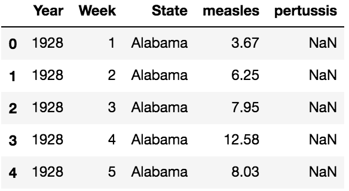
..

           
Here we can see a few of the weekly incidence values, but it is not
practical to see any trends or other features of the data from a textual
representation of a small subset or even from the 222,768 raw weekly
values. To start with, let's make this a simpler example by reducing it
to a dataframe with the average incidence of measles per year per state,
summing across all weeks for the year:

.. code:: ipython3

    by_year = df.groupby(['Year', 'State']).sum()
    by_year = by_year.groupby('Year').mean()[['measles']]
    by_year.head()

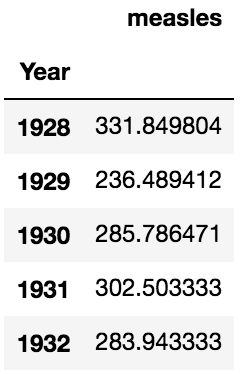
..

We can now start looking at how to explore this data visually, and can
return to the richer dataset once we see how it works in the simple case.

Exploring a simple dataset
==========================

In order to plot ``by_year``, we need to tell Holoviews what sort of
data it is, which will determine how it gets plotted:

.. code:: ipython3

    hv.Curve(by_year) + hv.Area(by_year) + hv.Scatter(by_year)

.. image:: images/output_7_0.pdf
..

Here we've used the HoloViews operator ``+`` to lay out three possible
visualizations side by side for easy comparison. Of these, the Area plot
seems like the clearest way to convey how the average measles incidence
has varied over time, so let's assign that one to a Python variable for
easy reference:

.. code:: ipython3

    area = hv.Area(by_year)
    area

.. image:: images/output_9_0.pdf
   :scale: 70
..

Here ``area`` is a Python object that clearly displays as a plot, in
this case as an SVG generated by Matplotlib. If you were using
Matplotlib or other plotting libraries directly, a displayable object
like ``area`` would be a dead end for analysis, i.e. all it could do is
be displayed. But with HoloViews, ``area`` is actually just a thin
wrapper around your data, making it instantly visualizable while also
preserving the full underlying data:

.. code:: ipython3

    area.data.head()

..

and supporting data-structure operations like indexing:

.. code:: ipython3

    area[1960], area[1980]

.. parsed-literal::

    (269.96705882352944, 5.58235294117647)

plus transformations like selection, conversion to other visual
representations, or sampling:

.. code:: ipython3

    area[1960:1980] + hv.Curve(area) + \
    area.sample(Year=[1960,1980,2000])

.. image:: images/output_15_0.pdf
..

We can also easily customize how we want ``area`` to appear, by
specifying Matplotlib options:

.. code:: ipython3

    wide = area.options(aspect=3, fig_size=300,
                        facecolor='DarkSeaGreen')
    wide

.. image:: images/output_17_0.pdf
..

One of the most important uses for this flexibility is to capture your
understanding of a dataset, making the visualization richer by
annotating it with other relevant data. For instance, here you can
clearly see that average measles incidence dropped precipitously in the
mid-1960s, and Wikipedia will tell us that the `Measles
vaccine <https://en.wikipedia.org/wiki/Measles_vaccine>`__ was
introduced in 1963. To make sure that others can see this connection, we
can annotate ``wide`` with that information:

.. code:: ipython3

    annotated = wide * hv.VLine(1963) * hv.Text(1963, 
        500, " Vaccine introduced", halign='left')
    annotated

.. image:: images/output_19_0.pdf
..

We now have a visualization that tells a story, i.e. that measles
incidence was highly variable but always substantial until the
introduction of the vaccine in 1963 brought it down to negligible
levels. But ``annotated`` is still just your data, now embedded into a
hierarchical container object called an ``Overlay``:

.. code:: ipython3

    print(annotated)

.. parsed-literal::

    :Overlay
       .Area.I  :Area   [Year]   (measles)
       .VLine.I :VLine   [x,y]
       .Text.I  :Text   [x,y]

.. code:: ipython3

    annotated.Area.I.data.head()

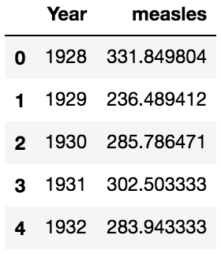
..

So you can still work just as easily with ``annotated`` as with your
original dataframe ``by_year``, now with a rich visual representation
and unlimited ability for sampling, slicing, or any other operations
that require the original data.

Exploring a multidimensional dataset
====================================

In the section above, we first reduced the dataframe into ``by_year``
for simplicity, removing state-specific information. However, a richer
set of behavior is available if we preserve some of the variation
available in the original dataset. Let's start with declaring that both
'Year' and 'State' are independent variables (called "key dimensions" in
HoloViews), that 'measles' is a dependent variable (called a "value
dimension" in HoloViews), and then sum all the weekly incidences to get
the overall yearly incidence per year and state:

.. code:: ipython3

    ds = hv.Dataset(df, ['Year', 'State'], 'measles')\
                   .aggregate(function=np.nansum)
    ds

.. parsed-literal::

    :Dataset   [Year,State]   (measles)

Here you can see from the textual representation that ``ds`` is not
visualizable, because we have not specified any particular visual form
it should take; it's just a set of numbers indexed by Year and State.
But we can easily choose a visual representation, selecting which
columns should be mapped on to the horizontal and vertical axes of a
Curve:

.. code:: ipython3

    by_state = ds.to(hv.Curve, 'Year', 'measles') 
    by_state * hv.VLine(1963).options(color='black')

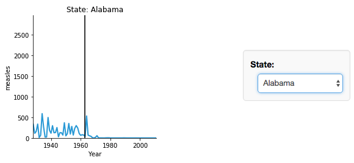
..

Wait -- why do we suddenly have an interactive widget? Here, we
previously declared that ``State`` is a key dimension, and thus
HoloViews knows that a value must be selected for it. Yet we never
declared how ``State`` should be mapped onto a visual attribute, leaving
it undefined. Rather than raising an error, HoloViews simply asks the
user which value to use, at which point all the information will be
available for specifying a particular plot.

The ``by_state`` object created by ``ds.to`` is a HoloViews ``HoloMap``,
which is a type of multidimensional dictionary. This HoloMap is indexed
by ``State``, because the original key dimension 'Year' has been mapped
onto the x axis of the underlying Curve:

.. code:: ipython3

    print(by_state)

.. parsed-literal::

    :HoloMap   [State]
       :Curve   [Year]   (measles)

Other key dimensions similarly not used in the plot will form additional
selector or numerical widgets for the user to choose from.

As you can see above, a HoloMap can be used in most cases where a
specific plot can be used, whether alone or combined with overlays or
laid out with other data. If you do not want to use selector widgets,
you can use a Jupyter-specific command to tell HoloViews to map any
extra dimensions onto frames of an animation instead:

.. code:: ipython3

    %%output holomap="scrubber"
    by_state * hv.VLine(1963).options(color='black')

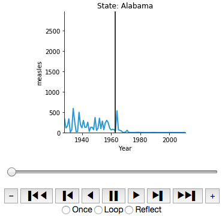
..

Of course, widgets and animations are only useful for exploring a
multidimensional dataset if you are in an interactive session or on a
web page, and so once you are ready to put your results into a printed
or PDF document you can instead further select a specific plot
explicitly:

.. code:: ipython3

    by_state["Texas"] + by_state["New York"]

.. image:: images/output_31_0.pdf
..

Or you can facet a dimension automatically using '.layout()' or
'.grid()', optionally subselecting along it first to make it a
reasonable number of plots):

.. code:: ipython3

    states = ['New York',
              'New Jersey',
              'California',
              'Texas']
    selected = by_state.select(State=states,
                               Year=(1930, 2005))
    
    selected.layout('State') * hv.VLine(1963)

.. image:: images/output_33_0.pdf
..

Or you can overlay everything into one plot:

.. code:: ipython3

    selected.overlay().options(aspect=3, fig_size=300)

.. image:: images/output_35_0.pdf
..

Of course, even with only four states this plot is very difficult to
read, and if you want to show data from all the states you can summarize
and aggregate it, to compute means and error bars:

.. code:: ipython3

    agg = ds.aggregate('Year', function=np.mean,
                       spreadfn=np.std)
    
    c = hv.Curve(agg).options(aspect=4)
    e = hv.ErrorBars(agg,vdims=['measles',
        'measles_std']).redim.range(measles=(0, None))
    
    ( c * e * hv.VLine(1963)  +  c * hv.Spread(e) * \
      hv.VLine(1963) ).options(fig_size=150).cols(1)

.. image:: images/output_37_0.pdf
..

Interactive plotting with Bokeh
===============================

The plots above all use Matplotlib to render SVG or PNG images that can
be displayed in a web browser or converted into formats embeddable in
documents (like this chapter) or presentations. As you can see from the
examples, the HoloViews API focuses on the data and its visual form,
rather than on the underlying plotting library, and the same code can be
used with Bokeh to create interactive HTML representations instead. To
use Bokeh, either change the ``hv.extension()`` call above to list
``'bokeh'`` first, specify the backend for a particular notebook cell
using ``%%output``, or specify the backend for all subsequent plots
in a notebook using ``%output``:

.. code:: ipython3

    %output backend='bokeh'

For instance, if you use Bokeh to make a plot of the overlaid data:

.. code:: ipython3

    selected.options(tools=['hover'],width=800).overlay()

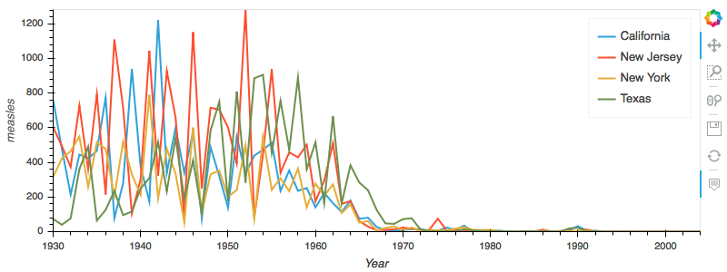
..

you can see that the same code works with both backends, apart from
differences in the options accepted (Bokeh expects "height" and "width"
while Matplotlib uses "fig\_size" and "aspect", and Bokeh has options
for controlling interactive behavior like hovering). The resulting plots
are very similar, but if this document were a web page, the user would
be able to interactively zoom and pan in the plot, hover to see the
numerical values on each curve, and click on lines in the legend to show
and hide each curve. This interactive capability can make it possible to
understand even a jumbled plot like this one, or to get numerical values
out of a plot like:

.. code:: ipython3

    ds.select(State=states, Year=(1980, 1990))\
      .to(hv.Bars, ['Year', 'State'], 'measles').sort()\
      .options(width=800, height=400, tools=['hover'], 
               xrotation=90, group_index=1, 
               show_legend=False)

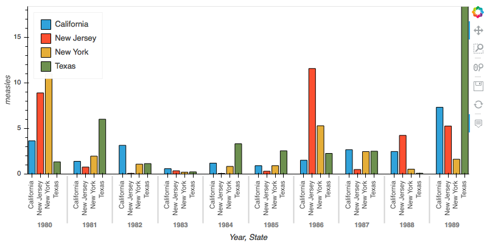
..

If we really want to invest a lot of time in making a fancy interactive
plot, we can customize it to try to show *all* the yearly data about
measles at once, with missing data shown as white:

.. code:: ipython3

    def nansum(a, **kwargs):
        return np.nan if np.isnan(a).all() \
               else np.nansum(a, **kwargs)

.. code:: ipython3

    heatmap = hv.HeatMap(df, ['Year','State'], 'measles')\
        .aggregate(function=nansum)\
        .options(toolbar='above', height=500, width=900,
                 tools=['hover'], logz=True, xaxis=None,
                 invert_yaxis=True, labelled=[])\
        .relabel('Measles Incidence')\
    
    agg = hv.Dataset(heatmap)\
        .aggregate('Year', np.mean, np.std)\
        .options(xrotation=90, height=200,
                 show_title=False)
    
    marker = hv.Text(1963, 800,
        u'\u2193 Vaccine introduced', halign='left')
    
    (heatmap + (agg*marker).options(width=900)).cols(1)

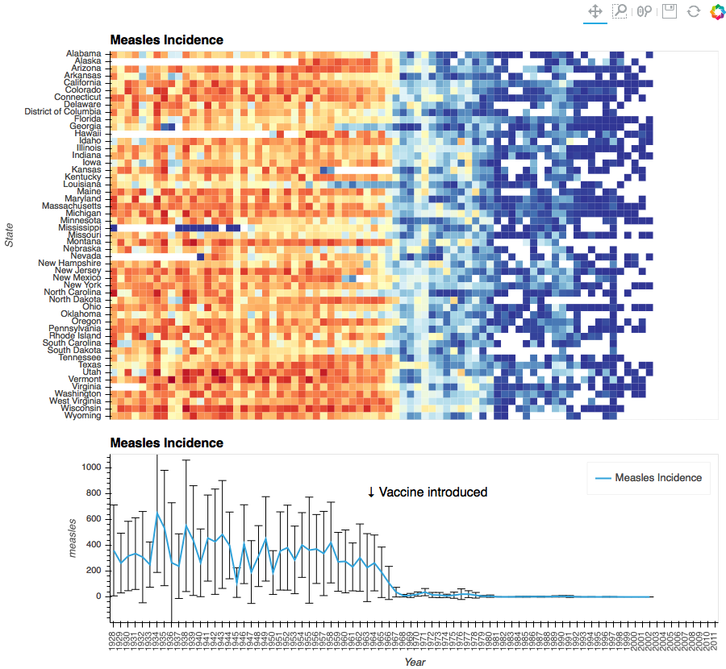
..

Again, if this plot were in a web browser, users would be able to hover
over any of the heatmap bins here to reveal the underlying numerical
values, and we could set up linked plots updated on a click or
selection, perhaps showing the data for each state or the weekly data
for that year as a curve, or comparing measles against incidence of
other diseases whose vaccines were introduced in a different year. See
`holoviews.org <http://holoviews.org/user_guide/Custom_Interactivity.html>`__
for more details.

For high-dimensional datasets with additional data variables, we can
compose all the above faceting methods where appropriate. As an example,
let's look at the Iris dataset, which has samples with several different
value dimensions (lengths and widths of flower parts, in this case):

.. code:: ipython3

    from holoviews.operation import gridmatrix
    from bokeh.sampledata.iris import flowers as iris
    
    iris.tail()

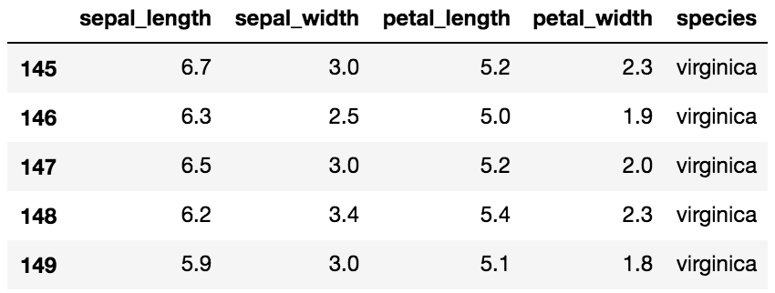
..

We can look at all these relationships at once, interactively:

.. code:: ipython3

    options = {
      'NdOverlay': dict(batched=False), 
      'Bivariate': dict(bandwidth=0.5, 
         cmap=hv.Cycle(['Blues','Reds','Oranges'])), 
      'Points': dict(size=2, tools=
         ['box_select', 'lasso_select'])}
    
    iris_ds = hv.Dataset(iris).groupby('species')\
        .overlay()
    
    density = gridmatrix(iris_ds, diagonal_type=
        hv.Distribution, chart_type=hv.Bivariate)
    
    points = gridmatrix(iris_ds, chart_type=hv.Points)
    
    (density * points).options(options)

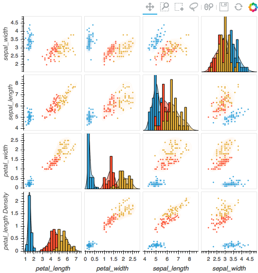
..

If you view this plot in a web browser (with or without a running
Python server), you can use the various tools Bokeh provides here to
explore the data without any coding. As with any Bokeh plot, you can
zoom and pan, and here we have also enabled the box and zoom select
tools that let you highlight a portion of the data points and see them
marked on all the other linked plots, to help you understand how each
of these dimensions relate to each other.

This example also illustrates that options can be supplied or changed
at any time (resulting in a logically distinct new object), here using
the element type to apply different options to the underlying Points
and other objects.

Large data and geo data
=======================

PyViz is a modular suite of tools, and when you need capabilities not
handled by HoloViews, Matplotlib, and Bokeh as above, you can bring
those in:

-  `GeoViews <http://geo.holoviews.org>`__: Visualizable geographic
   HoloViews objects
-  `Datashader <http://datashader.org>`__: Rasterizing huge
   HoloViews objects to images quickly
-  `Param <https://ioam.github.io/param>`__: Declaring user-relevant
   parameters, making it simple to work with widgets inside and outside
   of a notebook context
-  `Colorcet <http://bokeh.github.io/colorcet>`__: perceptually
   uniform colormaps for big data

To illustrate how this works, we'll look at a large(ish) dataset of 10
million taxi trips on a map.

.. code:: ipython3

    import dask.dataframe as dd
    import geoviews as gv
    import cartopy.crs as crs
    from colorcet import fire
    from holoviews.operation.datashader import datashade
    
    url   = 'https://server.arcgisonline.com/ArcGIS/'\
            'rest/services/World_Imagery/MapServer/'\
            'tile/{Z}/{Y}/{X}.jpg'
    topts = dict(width=700, height=600, bgcolor='black',
                 xaxis=None, yaxis=None, show_grid=False)
    tiles = gv.WMTS(url, crs=crs.GOOGLE_MERCATOR)\
            .options(**topts)
    
    dopts = dict(width=1000, height=600, 
                 x_sampling=0.5, y_sampling=0.5)
    taxi  = dd.read_parquet('nyc_taxi_wide.parq').persist()
    pts   = hv.Points(taxi, ['pickup_x', 'pickup_y'])
    trips = datashade(pts, cmap=fire, **dopts)
    
    tiles * trips

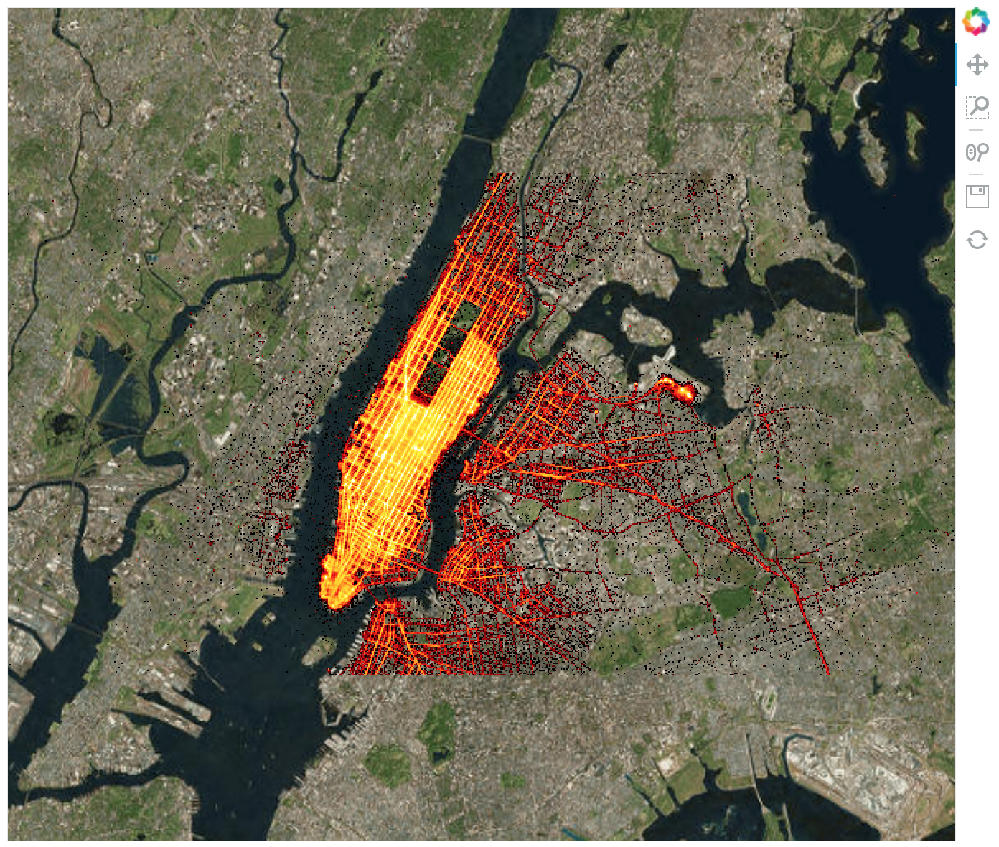
..

As you can see, you can specify Earth-based plots easily with GeoViews,
and if your HoloViews objects are too big to visualize in Matplotlib or
in a web browser directly, you can add ``datashade()`` to render them
into images as needed. With Bokeh, the data will be rendered dynamically
on every zoom or pan, providing the experience of exploring your data
even though the data is always pre-rendered to an image before providing
it to the web browser.

Interactive apps and dashboards
===============================

Often, a static image is an appropriate outcome from a visualization
project, suitable for embedding in documents like this one and in
presentations. However, in other cases the results from a project are
better delivered as an application that lets users select and view the
data of most interest to them. HoloViews provides widgets for such an
app automatically, as you saw above, in the case of declared dimensions
like those corresponding to a parameter sweep. However, other fully
custom controls are often needed in such apps, and the Param library
lets you easily set up arbitrary custom controls that communicate
between JavaScript and Python much as HoloViews and Bokeh do. Using
these tools, you can easily add widgets to control filtering, selection,
and other options interactively, either in a Jupyter notebook or in a
standalone server:

.. code:: ipython3

    import param, parambokeh
    from colorcet import cm_n
    from holoviews.streams import RangeXY
    
    class NYCTaxi(hv.streams.Stream):
        alpha = param.Magnitude(default=0.75, doc="Opacity")
        colormap = param.ObjectSelector(default=cm_n["fire"],
            objects=cm_n.values())
        location = param.ObjectSelector(default='dropoff',
            objects=['dropoff', 'pickup'])
    
        def make_view(self, x_range, y_range, **kwargs):
            pts   = hv.Points(taxi, [self.location+'_x',
                                     self.location+'_y'])
            trips = datashade(pts, cmap=self.colormap,
                x_range=x_range, y_range=y_range, 
                dynamic=False, **dopts)
            return tiles.options(alpha=self.alpha) * trips

.. code:: ipython3

    explorer = NYCTaxi(name="NYC Taxi Trips")
    parambokeh.Widgets(explorer, callback=explorer.event)
    hv.DynamicMap(explorer.make_view,
                  streams=[explorer, RangeXY()])

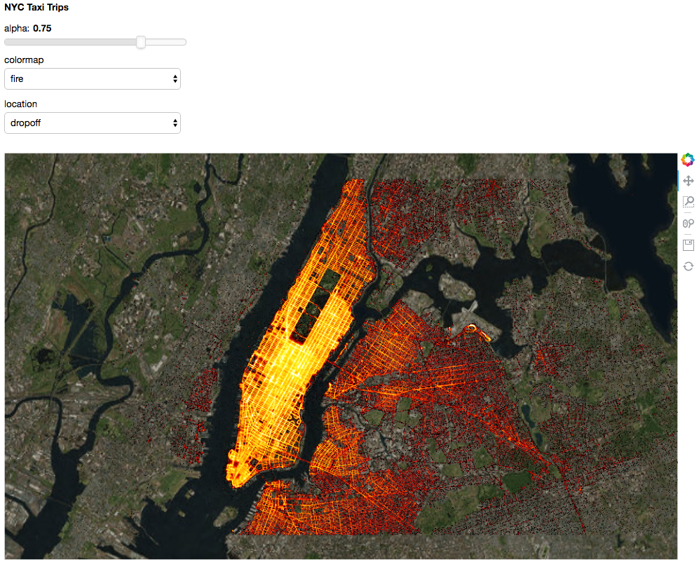
..

As you can see, the PyViz tools let you integrate visualization into
everything you do, using a small amount of code that reveals your data's
properties and then immediately captures your understanding of it. If
you want to explore further, visit `PyViz.org <http://pyviz.org>`__,
`HoloViews.org <http://holoviews.org>`__,
`GeoViews.org <http://geoviews.org>`__, and
`Datashader.org <http://datashader.org>`__, which have extensive
tutorials, user guides, and reference material covering the topics above
along with:

-  A wide range of other plotting types (network graphs, raster images,
   irregularly gridded data, vector fields, polygons, contours, and many
   more)
-  Streaming data, big data, and gridded data
-  Animations
-  Drawing and annotation tools
-  Selection tools
-  Geographic shapes, projections, and tile servers

Have fun!

Acknowledgements
================

None of the work in this chapter would have been possible without the
generous efforts of the authors of the scientific Python packages
that it builds on, such as Numpy, Pandas, Matplotlib, and Bokeh.

This work was funded in part by grant 1R01-MH66991 to the
University of Texas at Austin from the USA National Institute
of Mental Health, by grant EP/F500385/1 from the UK EPSRC
and MRC research councils, by the Institute for Adaptive
and Neural Computation at the University of Edinburgh, and 
by Anaconda, Inc. 

All packages used here are freely available for commercial or
non-commercial use under a BSD license (see each repository for
details).
