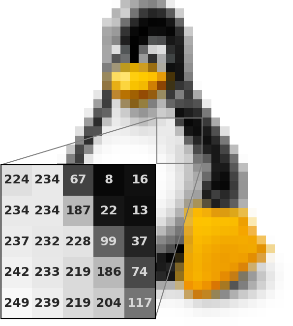
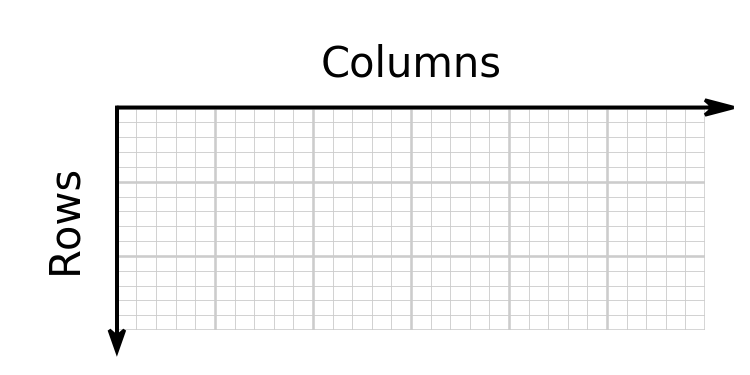
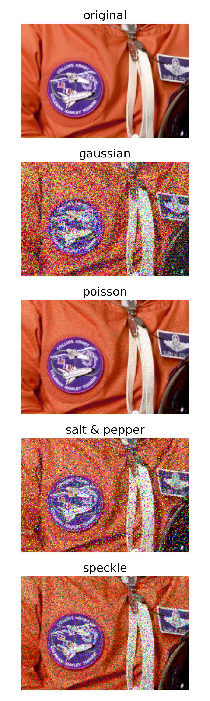
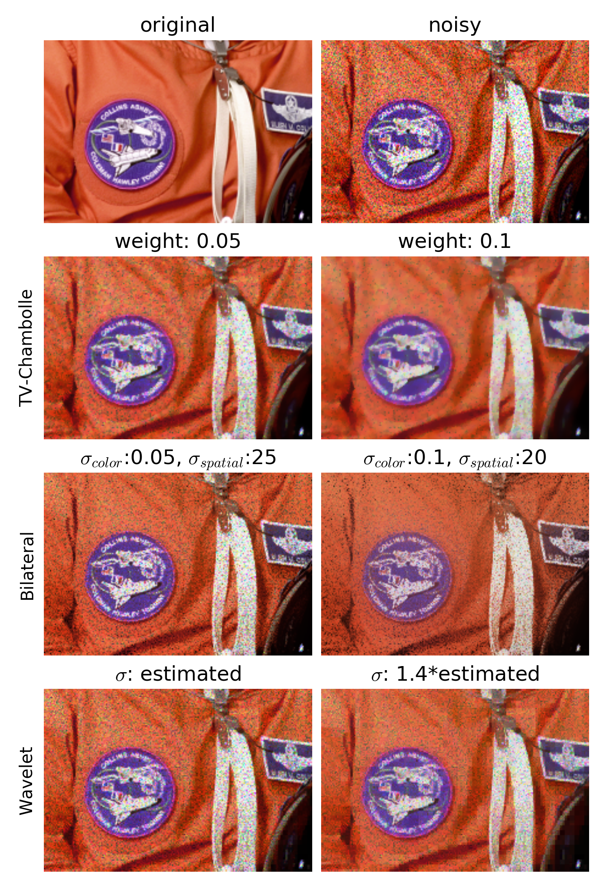
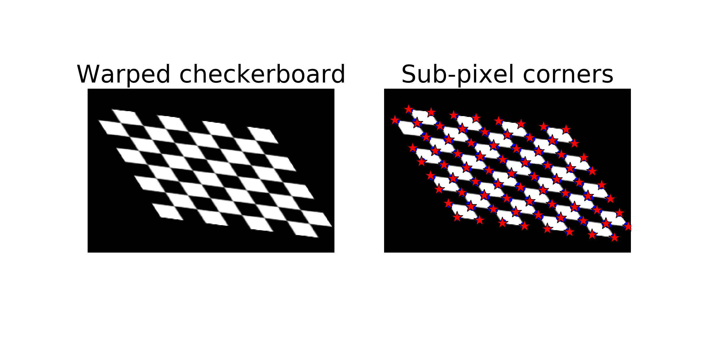
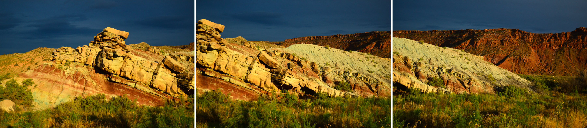
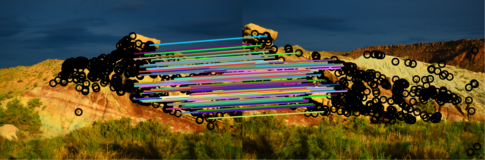
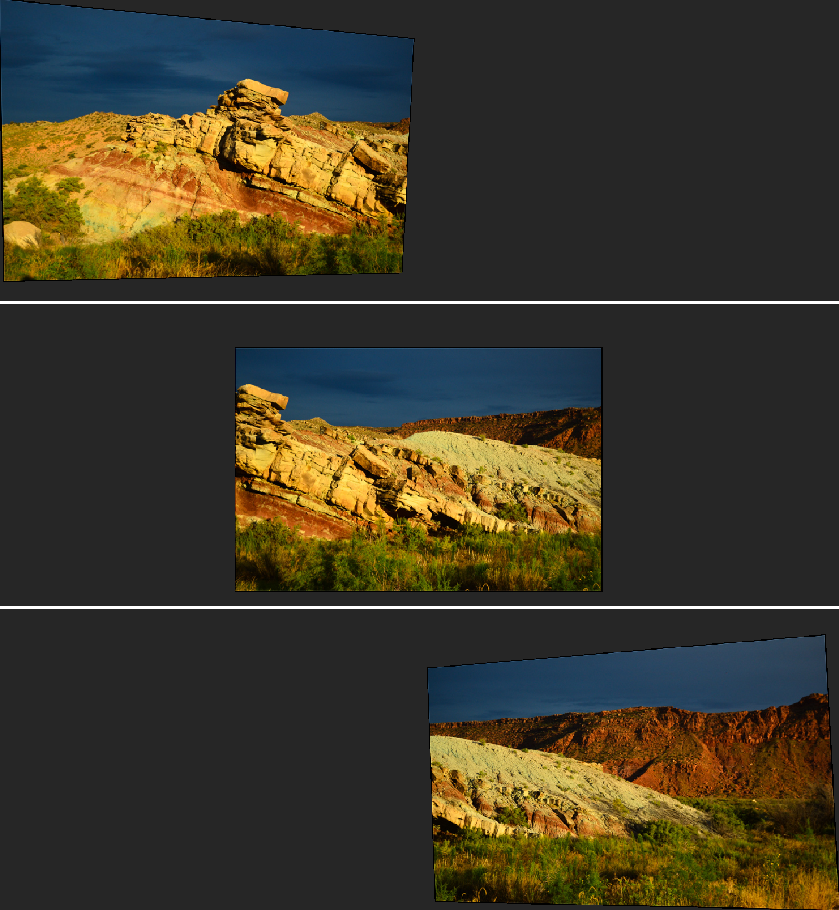
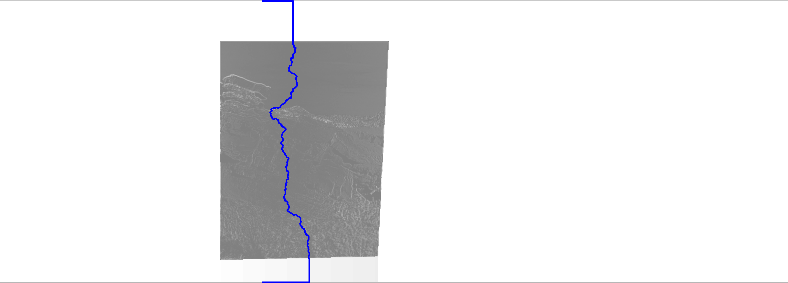
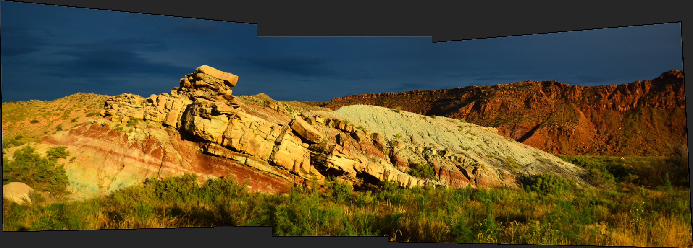

:author: Joshua D. Warner
:email: joshua.dale.warner@gmail.com
:institution: Mayo Clinic, Rochester, USA
:first-author:

:author: Alexandre F. de Siqueira
:email: alexandredesiqueira@programandociencia.com
:institution: University of Campinas, Campinas, Brazil
:institution: TU Bergakademie Freiberg, Freiberg, Germany
:equal-contributor:

:author: Emmanuelle Gouillart
:email: emmanuelle.gouillart@nsup.org
:institution: Joint Unit CNRS/Saint-Gobain Surface of Glass and Interfaces, Aubervilliers, France
:equal-contributor:

:author: Stéfan van der Walt
:email: stefanv@berkeley.edu
:institution: Berkeley Institute for Data Science, University of California at Berkeley, USA
:corresponding:

------------
scikit-image
------------

.. class:: abstract

   ``scikit-image`` is an image processing library that implements algorithms and utilities for use in research, education and industry applications. It is released under the liberal Modified BSD open source license, provides a well-documented API in the Python programming language, and is developed by an active, international team of collaborators. In this chapter we highlight the advantages of open source to achieve the goals of the ``scikit-image library``, and we showcase several real-world image processing applications that use ``scikit-image``. More information can be found on the project homepage, http://scikit-image.org.

.. class:: keywords

   image processing, computer vision, python

Introduction
------------

``scikit-image`` is an image processing library designed to complement and extend the capabilities of the core scientific Python libraries NumPy and SciPy for image processing applications [Van14]_.  Like other ``scikits``, it is domain-specific in scope and moves faster than the core libraries to meet users' evolving needs.

Images are NumPy arrays
***********************

Images are simply a collection of data on a regular grid, represented by a NumPy array (see Figure :ref:`penguin`).  Thus, ``scikit-image`` shares the foundational data representation of the scientific Python ecosystem, allowing maximum compatibliity [Van11]_.

Essentially all operations in ``scikit-image`` are defined for a two-dimensional images and, where possible, algorithms are generalized to work with arbitrary dimensionality.  Some images, like color images, may have more than one channel, e.g., red, green, and blue (RGB) with color information carried in an additional dimension.  In such cases, a ``multichannel=True`` keyword argument may need to be set.

   This enlarged public domain image of Tux, the Linux kernel mascot, shows individual pixels.  The inset illustrates the luminance gray value at each underlying point. :label:`penguin`

A note on image coordinates
***************************

It bears repeating that ``scikit-image`` shares NumPy conventions for array indexing.  When specifying points, one must use ``(row, column)`` indexing, not ``(x, y)`` coordinates.  For a two-dimensional image, the origin is in the upper left corner.  Figure :ref:`row-col` illustrates how indexing works in NumPy and ``scikit-image``.

   Illustration of NumPy ``(row, column)`` indexing for a two-dimensional array or image.  Note the origin is in the upper left. :label:`row-col`

TODO:  Parallel & distributed processing via dask
*************************************************

Package roadmap
---------------

Most of the functionality in ``scikit-image`` is located in *subpackages*, which group similar tools.  This is similar to how SciPy is designed [Oli07]_ [Jar11]_.  There is far more functionality in ``scikit-image`` than can be conveyed in a single chapter, so a brief overview of the subpackages included as of version 0.12.3 is included below.

``color``
    Color conversion routines, including grayscale to RGB (``rgb2gray``) and vice versa (``gray2rgb``) as well as many additional color spaces.
``data``
    Test images shipped with the package, including ``astronaut`` (see crop in Figure :ref:`noise-types`).
``draw``
    Routines to draw primitives including lines, shapes, and text.
``exposure``
    Intensity and contrast adjustments.
``feature``
    Feature detection, extraction, and matching. This subpackage includes ``ORB``, which is used in the panorama example to follow, as well as blob-finding and feature matching algorithms.
``filters``
    Whole-image changes like sharpening.  See also the rank filters exposed in ``skimage.filters.rank``.
``future``
    Similar to Python's ability to import from the ``__future__``, this is a glimpse into the future of ``scikit-image``.  Contains stable functions which are ready for use, but with API that may not be finalized.
``graph``
    Graph theory, including path finding which is used in the panorama example to follow.
``io``
    Reading and writing images; multiple plugins supported.
``measure``
    Tools to quantify image properties such as length or shape.  Also includes ``marching_cubes``, ``marching_squares``, and Hough transforms to find lines, circles, or ellipses.
``morphology``
    Morphological operations, e.g., dilation and erosion. Binary and grayscale morphology supported.
``novice``
    Simplified teaching interface.
``restoration``
    Reduce noise or deconvolve images.
``segmentation``
    Partition an image into two or more regions.  Includes both unsupervised (``felzenszwalb``, ``slic``, ``quickshift``) and supervised (``random_walker``) methods.
``transform``
    Warp or rotate images.
``util``
    Common utility functions.
``viewer``
    QT-based interactive GUI.

Reducing noise
--------------

There are many types of noise which can affect images, and the first step to reducing unwanted noise is to understand what kind of noise is present.  In scikit-image, there is a noise generation utility named ``random_noise`` located in ``skimage.util`` which can generate most commonly encountered types of noise.  In Figure :ref:`noise-types` we show a comparison of several common noise types applied to a crop of the ``astronaut`` image available in ``skimage.data`` [#]_. This crop has both fine detail in the NASA patch and flat fields, so it is a good example to evaluate denoising algorithms.

.. [#] Press photograph of NASA astronaut Eileen Collins, in the public domain.

   Original, clean image and four different types of noise applied to it with ``skimage.util.random_noise``.  Poisson noise is subtle, but difficult to remove, whereas gaussian as well as salt & pepper are not subtle but also challenging. :label:`noise-types`

It should come as no surprise that a particular denoising algorithm may be stronger or weaker at removing a particular kind of noise.  In this example the noise type is speckle noise, which is a kind of multiplicative noise often encountered in ultrasound medical imaging. Three different denoising algorithms implemented in scikit-image will be applied: total variation, bilateral, and wavelet denoising.

The act of denoising is always a balance.  It is almost never possible to entirely remove noise; doing so would eliminate the fine features and texture one desires to keep.  When used to excess, or with parameters set too high, denoising algorithms typically produce “posterized” images with flat domains separated by sharp edges.  Denoising is thus typically an iterative approach to control the tradeoff between smoothing and faithfulness to the original image by tuning function parameters.

.. code-block:: python

   from skimage import data, img_as_float
   from skimage.util import random_noise

   astronaut = img_as_float(data.astronaut())
   astro = astronaut[300:450, 100:320]

   sigma = 0.3
   noisy = random_noise(img_astro, var=sigma**2)

The ``noisy`` image generated here and seen in Figure :ref:`denoise` is what our approaches below will attempt to fix.  Denoising algorithms are located in ``skimage.restoration``, prefixed with ``denoise_``.

   Top row: original image and with speckle noise applied. Subsequent rows show total variation, bilateral, and wavelet denoising respectively with pertinent settings in the titles. :label:`denoise`

Total variation minimization
****************************

Denoising by minimizing the total variation attempts to change the image in such a way as to reduce the total variation present.  Thus, if applied too strongly it will eliminate fine features of the original image along with noise.  The total variation norm being minimized is the L1 norm of the image gradient.  This is an excellent method to reduce salt-and-pepper noise.  As the norm being minimized is that of the gradient, when applied too strongly this algorithm results in very smooth results with no hard edges.

There are two approaches to total variation denoising implemented in scikit-image: split-Bregman [Get12]_ and Chambolle [Cha04]_. In this example the latter is used.

.. code-block:: python

   from skimage.restoration import denoise_tv_chambolle

   tv_cham_low = denoise_tv_chambolle(
       img_noisy, weight=0.05, multichannel=True)
   tv_cham_high = denoise_tv_chambolle(
       img_noisy, weight=0.1, multichannel=True)

The function ``denoise_tv_chambolle`` accepts several parameters, of which the most pertinent are ``weight`` and ``multichannel``

* ``weight`` represents the denoising strength: the greater the weight, the more noise is removed (at the expense of fidelity to the input image).
* ``multichannel`` enables the option to apply total-variation denoising separately for each color channel. This parameter defaults to ``False`` but should be set ``True`` for color images; if not, the result will have color fringing artifacts.

The results of total variation denoising via the Chambolle method are shown in the second row of Figure :ref:`denoise`.

Bilateral filter
****************

A bilateral filter [Tom98]_ reduces noise while preserving edges. It assigns new values based on a local, weighted mean with two main features: proximity and similar value.  The bilateral filter is implemented by the function `denoise_bilateral`, contained in the module `restoration`.  This filter tends to produce piecewise-constant or cartoon-like images if applied to excess.

.. code-block:: python

   from skimage.restoration import denoise_bilateral

   bilat_low = denoise_bilateral(
       img_noisy, sigma_color=0.05, sigma_spatial=25)
   bilat_high = denoise_bilateral(
       img_noisy, sigma_color=0.1, sigma_spatial=20)

``denoise_bilateral`` allows the user to control the weight given to closeness in color and spatial proximity separately with the keyword arguments ``sigma_color`` and ``sigma_spatial``:

* ``sigma_color`` represents the radiometric similarity, i.e., the standard deviation for color/value distance. The expected value is on the range [0, 1].  In the default case, `None`, the standard deviation of the input image is used.
* ``sigma_spatial`` is the standard deviation for range distance. A larger value allows more distant pixels to more strongly influence the result.

The results of bilateral filter denoising are shown in the third row of Figure :ref:`denoise`.

Wavelet denoising
*****************

Wavelets [#]_ are a fascinating mathematical construct that can be thought of as a way to combine the best of frequency and time domain analysis.  They are applied at multiple scales.  For brevity, the most important feature of wavelets for denoising purposes is that of *sparsity*.

.. [#] At time of writing, wavelet algorithms are only available in the devevelopment version of scikit-image.  They will be available in stable version of scikit-image 0.13 and above.

Wavelets, when applied to 2-dimensional images, decompose the image into a representation made up of many individual wavelets.  This representation is sparse, i.e., there are relatively few wavelet coefficients with high values and many that are quite low.  Denoising simply sets a threshold below which small coefficients are discarded, then inverts the result yielding an image with less noise.  Sparse representations are similarly useful for image compression.

.. code-block:: python

   from skimage.restoration import (denoise_wavelet,
                                    estimate_sigma)
   # Need to estimate noise present
   sigma_est = estimate_sigma(
       noisy, multichannel=True, average_sigmas=True)

   wave_low = denoise_wavelet(noisy, sigma=sigma_est,
                              multichannel=True)
   wave_high = denoise_wavelet(noisy,
                               sigma=1.4*sigma_est,
                               multichannel=True)

The primary control over denoising strength is ``sigma=``, and there is also an algorithm to estimate the noise present ``estimage_sigma``.  Generally this is an underestimate due to clipping, as true Gaussian noise has no limit to its range but the image data does.

The results of wavelet denoising are shown in the fourth row of Figure :ref:`denoise`.

Corner detection
----------------

Corner detection is used to extract sharp features from an image. There are several corner detectors implemented on scikit-image. This example shows the Harris corner detector [Har88]_, which finds corner points and determine their position with sub-pixel precision.

The input image will be based on an image of a checkerboard, given by the function ``data.checkerboard()``, but a rectangular checkerboard is too easy.  Using the functions ``warp`` and ``AffineTransform`` contained in in ``skimage.transform``, the checkerboard can be stretched and warped out of shape (see Figure :ref:`corners`)

.. code-block:: python

   from skimage import data
   from skimage.transform import warp, AffineTransform

   affine = AffineTransform(
       scale=(0.8, 1.1), rotation=1, shear=0.7,
       translation=(220, 50))
   image = warp(data.checkerboard(), affine.inverse,
                output_shape=(200, 310))

Then we use three functions from ``skimage.feature``:

* ``corner_harris`` computes the Harris corner measure response image.
* ``corner_peaks`` identifies corners in a corner measure response image, like the one returned by ``corner_harris``.
* ``corner_subpix`` determines the sub-pixel position of corners.

.. code-block:: python

   from skimage.feature import (corner_harris,
                                corner_subpix,
                                corner_peaks)

   harris_coords = corner_peaks(corner_harris(image))
   harris_subpix = corner_subpix(image, harris_coords)

The detected corners are shown in Figure :ref:`corners`.

   On left, the warped checkerboard.  On right, corners detected with the Harris corner detector are marked in red.  These corners are defined with sub-pixel precision, but the markers are larger for legibility. :label:`corners`

Panorama stitching
------------------

This example stitches three images into a seamless panorama using several tools in scikit-image, including feature detection [Rub11]_, RANdom SAmple Consensus (RANSAC) [Fis81]_, graph theory, and affine transformations.  The images used in this example are available at https://github.com/scikit-image/skimage-tutorials/tree/master/images/pano named ``JDW_9*.jpg``, released under the CC-BY 4.0 by the author.

Load images
***********

The ``io`` module in scikit-image allows images to be loaded and saved. In this case the color panorama images will be loaded into an iterable `ImageCollection`, though one could also load them individually.

.. code-block:: python

   from skimage import io
   pano_images = io.ImageCollection(
       '/path/to/images/JDW_9*')

   Panorama source images, taken on the trail to Delicate Arch in Arches National Park, USA.  Released under CC-BY 4.0 by Joshua D. Warner. :label:`fig-pano0`

Feature detection and matching
******************************

To correctly align the images, a *projective* transformation relating them is required.

1. Define one image as a *target* or *destination* image, which will remain anchored while the others are warped.
2. Detect features in all three images.
3. Match features from left and right images against the features in the center, anchored image.

In this series, the middle image is the logical anchor point.  Numerous feature detection algorithms are available; this example will use Oriented FAST and rotated BRIEF (ORB) features available as ``skimage.feature.ORB`` [Rub11]_.

.. code-block:: python

   import matplotlib.pyplot as plt
   from skimage.color import rgb2gray
   from skimage.feature import (ORB, match_descriptors,
                                plot_matches)

   # Initialize ORB
   orb = ORB(n_keypoints=800, fast_threshold=0.05)
   keypoints = []
   descriptors = []

   # Detect features
   for image in pano_images:
       orb.detect_and_extract(rgb2gray(image))
       keypoints.append(orb.keypoints)
       descriptors.append(orb.descriptors)

   # Match features from images 0 -> 1 and 2 -> 1
   matches01 = match_descriptors(descriptors[0],
                                 descriptors[1],
                                 cross_check=True)
   matches12 = match_descriptors(descriptors[1],
                                 descriptors[2],
                                 cross_check=True)

   # Show raw matched features from left to center
   fig, ax = plt.subplots()
   plot_matches(ax, pano_images[0], pano_images[1],
                keypoints[0], keypoints[1], matches01)
   ax.axis('off');

.. figure:: pano1_ORB-raw.png
   :align: center

   Matched ORB keypoints from left and center images from :ref:`fig-pano0`. Most features line up similarly, but there are a number of obvious outliers or false matches. :label:`fig-pano1`

Transform estimation
********************

To filter out the false matches observed in Figure :ref:`fig-pano1`, RANdom SAmple Consensus (RANSAC) is used [Fis81]_. RANSAC is a powerful method of rejecting outliers available in ``skimage.transform.ransac``. The transformation is estimated using an iterative process based on randomly chosen subsets, finally selecting the model which corresponds best with the majority of matches.

It is important to note the randomness inherent to RANSAC. The results are robust, but will vary slightly every time.  Thus, it is expected that readers' results will deviate slightly from the published figures after this point.

.. code-block:: python

   from skimage.measure import ransac
   from skimage.transform import ProjectiveTransform

   # Keypoints from left (src) to middle (dst) images
   src = keypoints[0][matches01[:, 0]][:, ::-1]
   dst = keypoints[1][matches01[:, 1]][:, ::-1]

   model_ransac01, inliers01 = ransac(
       (src, dst), ProjectiveTransform, min_samples=4,
       residual_threshold=1, max_trials=300)

   # Keypoints from right (src) to middle (dst) images
   src = keypoints[2][matches12[:, 1]][:, ::-1]
   dst = keypoints[1][matches12[:, 0]][:, ::-1]

   model_ransac12, inliers12 = ransac(
       (src, dst), ProjectiveTransform, min_samples=4,
       residual_threshold=1, max_trials=300)

   # Show robust, RANSAC-matched features
   fig, ax = plt.subplots()
   plot_matches(ax, pano_images[0], pano_images[1],
                keypoints[0], keypoints[1],
                matches01[inliers01])
   ax.axis('off');

The results of robust transform estimation with RANSAC are shown in Figure :ref:`fig-pano2`.

   The best RANSAC transform estimation uses only these keypoints. The outliers are now excluded (compare with Figure :ref:`fig-pano1`). :label:`fig-pano2`

Warp images into place
**********************

Before producing the panorama, the correct size for a new canvas to hold all three warped images is needed.  The entire size, or extent, of this image is carefully found.

.. code-block:: python

   # All three images have the same size
   r, c = pano_images[1].shape[:2]

   # Note that transformations take coordinates in
   # (x, y) format, not (row, column), for literature
   # consistency
   corners = np.array([[0, 0],
                       [0, r],
                       [c, 0],
                       [c, r]])

   # Warp image corners to their new positions
   warped_corners01 = model_ransac01(corners)
   warped_corners12 = model_ransac12(corners)

   # Extents of both target and warped images
   all_corners = np.vstack((warped_corners01,
                            warped_corners12,
                            corners))

   # Overall output shape is max - min
   corner_min = np.min(all_corners, axis=0)
   corner_max = np.max(all_corners, axis=0)
   output_shape = (corner_max - corner_min)

   # Ensure integer shape
   output_shape = np.ceil(
       output_shape[::-1]).astype(int)

Next, each image is warped and placed into a new canvas of shape ``output_shape``.

Translate middle target image
*****************************

The middle image is stationary, but still needs to be shifted into the center of the larger canvas.  This is done with simple translation using a ``SimilarityTransform``.

.. code-block:: python

   from skimage.transform import warp
   from skimage.transform import SimilarityTransform

   offset1 = SimilarityTransform(
       translation= -corner_min)

   # Translate pano1 into place
   pano1_warped = warp(
       pano_images[1], offset1.inverse, order=3,
       output_shape=output_shape, cval=-1)

   # Acquire the image mask for later use
   # Mask == 1 inside image, then return backgroun to 0
   pano1_mask = (pano1_warped != -1)[..., 0]
   pano1_warped[~pano1_mask] = 0

Apply RANSAC-estimated transforms
*********************************

The other two images are warped by ``ProjectiveTransform`` into place.

.. code-block:: python

   # Warp left image
   transform01 = (model_ransac01 + offset1).inverse
   pano0_warped = warp(
       pano_images[0], transform01, order=3,
       output_shape=output_shape, cval=-1)

   # Mask == 1 inside image, then return backgroun to 0
   pano0_mask = (pano0_warped != -1)[..., 0]
   pano0_warped[~pano0_mask] = 0

   # Warp right image
   transform12 = (model_ransac12 + offset1).inverse
   pano2_warped = warp(
       pano_images[2], transform12, order=3,
       output_shape=output_shape, cval=-1)

   # Mask == 1 inside image, then return backgroun to 0
   pano2_mask = (pano2_warped != -1)[..., 0]
   pano1_warped[~pano1_mask] = 0

See the warped images in :ref:`fig-pano3`.

   Each image is now correctly warped into a new frame with room for the others, ready to be composited/stitched together. :label:`fig-pano3`

Image stitching using minimum-cost path
***************************************

Because of optical non-linearities, simply averaging these images together will not work. The overlapping areas become significantly blurred.  Instead, a minimum-cost path can be found with the assistance of ``skimage.graph.route_through_array``. This function allows one to

* start at any point on an array
* find a particular path to any other point in the array
* the path found *minimizes* the sum of values on the path.

The array in this instance is a *cost array* which is carefully defined so the path found will be desired one, while the path itself is the *minimum-cost path*, or MCP. To use this technique we need starting and ending points, as well as a cost array.

Define seed points
******************

.. code-block:: python

   ymax = output_shape[1] - 1
   xmax = output_shape[0] - 1

   # Start anywhere along the top and bottom
   mask_pts01 = [[0,    ymax // 3],
                 [xmax, ymax // 3]]

   # Start anywhere along the top and bottom
   mask_pts12 = [[0,    2*ymax // 3],
                 [xmax, 2*ymax // 3]]

Construct cost array
********************
:label:`construct-costs`

For optimal results, great care goes into the creation of the cost array.  The function below is designed to construct the best possible cost array.  Its tasks are:

1. Start with a high-cost image filled with ones.
2. Use the mask - which defines where the overlapping region will be - to find the distance from the top/bottom edges to the masked area.
3. Reject mostly vertical areas.
4. Give a cost break to areas slightly further away, if the warped overlap is not parallel with the image edges, to ensure fair competition
5. Put the absolute value of the *difference* of the overlapping images in place

A convenience function ``generate_costs`` is provided in the Appendix which accomplishes the above.

.. code-block:: python

  # Use the generate_costs function
  costs01 = generate_costs(pano0_warped - pano1_warped,
                           pano0_mask & pano1_mask)
  costs12 = generate_costs(pano1_warped - pano2_warped,
                           pano1_mask & pano2_mask)

Find minimum-cost path and masks
********************************

Once the cost function is generated, the minimum cost path can be found simply and efficiently.

.. code-block:: python

   from skimage.graph import route_through_array

   # Find the MCP
   pts01, _ = route_through_array(
     costs01, mask_pts01[0], mask_pts01[1],
     fully_connected=True)

   pts01 = np.array(pts01)

   # Create final mask for the left image
   mask0 = np.zeros_like(pano0_warped[..., 0],
                         dtype=np.uint8)
   mask0[pts01[:, 0], pts01[:, 1]] = 1

   # Fill left side with flood_fill (in appendix)
   flood_fill(mask0, (0, 0), 1)

   The minimum cost path in blue is the ideal stitching boundary. It stays as close to zero (mid-gray) as possible throughout its path.  The background is the cost array, with zero set to mid-gray for better visibility.  Note the subtle shading effect of cost reduction below the difference region.  Readers' paths may differ in appearance, but are optimal for their RANSAC-chosen transforms.

Because ``mask0`` is a *final* mask for the left image, it needs to constrain the solution for the right image. This step is essential if there is large overlap such that the left and right images could theoretically occupy the same space.  It ensures the MCPs will not cross.

.. code-block:: python

   # New constraint modifying cost array
   costs12[mask0 > 0] = 1

   pts12, _ = route_through_array(
     costs12, mask_pts12[0], mask_pts12[1],
     fully_connected=True)

   pts12 = np.array(pts12)

   # Final mask for right image
   mask2 = np.zeros_like(mask0, dtype=np.uint8)
   mask2[pts12[:, 0], pts12[:, 1]] = 1

   # Fill right side of image
   flood_fill(mask2, (mask2.shape[0] - 1,
                      mask2.shape[1] - 1), 1)

   # Mask for middle image is one of exclusion
   mask1 = ~(mask0 | mask2).astype(bool)

Blend images together with alpha channels
*****************************************

Most image formats can support an alpha channel as an optional fourth channel, which defines the transparency at each pixel.  We now have three warped images and three corresponding masks.  These masks can be incorporated as alpha channels to seamlessly blend them together.

.. code-block:: python

   # Convenience function for alpha blending
   def add_alpha(img, mask=None):
     """
     Adds a masked alpha channel to an image.

     Parameters
     ----------
     img : (M, N[, 3]) ndarray
         Image data, should be rank-2 or rank-3
         with RGB channels
     mask : (M, N[, 3]) ndarray, optional
         Mask to be applied. If None, the alpha channel
         is added with full opacity assumed (1) for all
         locations.
     """
     from skimage.color import gray2rgb
     if mask is None:
       mask = np.ones_like(img)

     if img.ndim == 2:
       img = gray2rgb(img)

     return np.dstack((img, mask))

   # Applying this function
   left_final = add_alpha(pano0_warped, mask0)
   middle_final = add_alpha(pano1_warped, mask1)
   right_final = add_alpha(pano2_warped, mask2)

Matplotlib's ``imshow`` supports alpha blending, but the default interpolation mode causes edge effects [Hunt07]_.  So as we create our final composite image, interpolation is disabled.

.. code-block:: python

   fig, ax = plt.subplots()

   # Turn off matplotlib's interpolation
   ax.imshow(left_final, interpolation='none')
   ax.imshow(middle_final, interpolation='none')
   ax.imshow(right_final, interpolation='none')

   ax.axis('off')
   fig.tight_layout()
   fig.show()

   The final, seamlessly stitched panorama.

Final thoughts
--------------
Please cite the scikit-image paper [Van14]_ if you find ``scikit-image`` useful!  Citations allow developers to justify time invested in the package.

The authors would like to acknowledge and thank every contributor to ``scikit-image``.

References
----------
.. [Van14] van der Walt, S.; Schönberger, J. L.; Nunez-Iglesias, J;
           Boulogne, F; Warner, J. D.; Yager, N; Gouillart, E; Yu, T;
           the scikit-image contributors. *scikit-image: image
           processing in Python*, PeerJ, 2:e453, 2014.
           DOI:10.7717/peerj.453

.. [Oli07] Travis E. Oliphant. *Python for Scientific Computing.*
           Computing in Science & Engineering, 9:10-20, 2007. DOI:10.1109/MCSE.2007.58

.. [Jar11] Millman, K. J.; Aivazis, M. *Python for Scientists and
           Engineers.* Computing in Science & Engineering, 13:9-12,
           2011. DOI:10.1109/MCSE.2011.36

.. [Van11] van der Walt, S.; Colbert, S. C.; Varoquaux, G. *The
           NumPy Array: A Structure for Efficient Numerical
           Computation.* Computing in Science & Engineering, 13:22-30,
           2011. DOI:10.1109/MCSE.2011.37

.. [Hunt07] Hunter, J. D. *Matplotlib: A 2D graphics environment*,
            Computing In Science & Engineering, 9(3):90-95, 2007.
            DOI:10.5281/zenodo.61948

.. [Get12] Getreuer, P. *Rudin-Osher-Fatemi total variation
           denoising using split Bregman.* Image Processing On Line,
           2:74-95, 2012. DOI:10.5201/ipol.2012.g-tvd

.. [Cha04] Chambolle, A. *An algorithm for total variation
           minimization and applications.* Journal of Mathematical
           imaging and vision, 20(1-2):89-97, 2004.
           DOI: 10.1023/B:JMIV.0000011325.36760.1e

.. [Har88] Harris, C.; Stephens, M. *A combined corner and edge
           detector.* In Alvey vision conference 15:50, 1988.

.. [Tom98] Tomasi, C.; Manduchi, R. *Bilateral filtering for gray
           and color images.* IEEE Computer Vision, 1998. Sixth International Conference on, 839-846. 1998.

.. [Rub11] Rublee, E.; Rabaud, V.; Konolige, K.; Bradski, G.
           *ORB: an efficient alternative to SIFT or SURF*,
           IEEE International Conference on Computer Vision (ICCV),
           2564-2571, 2011. DOI:10.1109/ICCV.2011.6126544

.. [Fis81] Fischler, M. A.; Robert C. B. *Random sample consensus:
           a paradigm for model fitting with applications to image
           analysis and automated cartography.* Communications of
           the ACM, 24(6):381-395, 1981.

Appendix
--------

This supplemental appendix includes convenience functions which were deemed obstructive for the flow of the main chapter text.  They are referenced where appropriate above.  Including them resulted in more elegant and intuitive examples.

Minimum-cost-path cost array creation
*************************************
:label:`cost-arr-func`

This function generates an ideal cost array for panorama stitching, using the principles set forth in :ref:`construct-costs`.

.. code-block:: python

   def generate_costs(diff_image, mask,
                      vertical=True,
                      gradient_cutoff=2.,
                      zero_edges=True):
     """
     Ensure equal-cost paths from edges to
     region of interest.

     Parameters
     ----------
     diff_image : (M, N) ndarray of floats
         Difference of two overlapping images.
     mask : (M, N) ndarray of bools
         Mask representing the region of interest in
         ``diff_image``.
     vertical : bool
         Control if stitching line is vertical or
         horizontal.
     gradient_cutoff : float
         Controls how far out of parallel lines can
         be to edges before correction is terminated.
         The default (2.) is good for most cases.
     zero_edges : bool
         If True, the edges are set to zero so the
         seed is not bound to any specific horizontal
         location.

     Returns
     -------
     costs_arr : (M, N) ndarray of floats
         Adjusted costs array, ready for use.
     """
     if vertical is not True:  # run transposed
       return generate_costs(
         diff_image.T, mask.T, vertical=True,
         gradient_cutoff=gradient_cutoff).T

     # Start with a high-cost array of 1's
     diff_image = rgb2gray(diff_image)
     costs_arr = np.ones_like(diff_image)

     # Obtain extent of overlap
     row, col = mask.nonzero()
     cmin = col.min()
     cmax = col.max()

     # Label discrete regions
     cslice = slice(cmin, cmax + 1)
     labels = mask[:, cslice].astype(np.uint8).copy()

     # Fill top and bottom with unique labels
     masked_pts = np.where(labels)
     flood_fill(labels, (masked_pts[0][0],
                         masked_pts[1][0]), 2)
     flood_fill(labels, (0, labels.shape[0] // 2), 1)
     flood_fill(labels, (labels.shape[0] - 1,
                         labels.shape[1] // 2), 3)

     # Find distance from edge to region
     upper = (labels == 1).sum(axis=0)
     lower = (labels == 3).sum(axis=0)

     # Reject areas of high change
     ugood = np.abs(
       np.gradient(upper)) < gradient_cutoff
     lgood = np.abs(
       np.gradient(lower)) < gradient_cutoff

     # Cost break to areas slightly farther from edge
     costs_upper = np.ones_like(upper,
                                dtype=np.float64)
     costs_lower = np.ones_like(lower,
                                dtype=np.float64)
     costs_upper[ugood] = (
         upper.min() / np.maximum(upper[ugood], 1))
     costs_lower[lgood] = (
         lower.min() / np.maximum(lower[lgood], 1))

     # Expand from 1d back to 2d
     vdis = mask.shape[0]
     costs_upper = (
       costs_upper[np.newaxis, :].repeat(
         vdis, axis=0))
     costs_lower = (
       costs_lower[np.newaxis, :].repeat(
         vdis, axis=0))

     # Place these in output array
     costs_arr[:, cslice] = costs_upper * (labels==1)
     costs_arr[:, cslice] += costs_lower * (labels==3)

     # Finally, place the difference image
     costs_arr[mask] = np.abs(diff_image[mask])

     if zero_edges is True:  # top & bottom rows = 0
       costs_arr[0, :] = 0
       costs_arr[-1, :] = 0

     return costs_arr

Flood fill
**********
:label:`flood-fill`

This Cython function is a basic flood fill algorithm which accepts an array and modifies it in place.  The flood starts at a defined point, which is changed to a new value, then iteratively fills outward by doing the same at all connected points which carry the original value.

The conceptual analogy of this algorithm is the "bucket" tool in many photo editing programs.

.. code-block:: cython

   import cython
   import numpy as np
   cimport numpy as cnp

   # Compiler directives
   @cython.cdivision(True)
   @cython.boundscheck(False)
   @cython.nonecheck(False)
   @cython.wraparound(False)
   def flood_fill(unsigned char[:, ::1] image,
                  tuple start_coords,
                  Py_ssize_t fill_value):
     """
     Flood fill algorithm

     Parameters
     ----------
     image : (M, N) ndarray of uint8 type
         Image with flood to be filled. Modified
         inplace.
     start_coords : tuple
         Length-2 tuple of ints defining (row, col)
         start coordinates.
     fill_value : int
         Value to fill flooded area with.

     Returns
     -------
     None. ``image`` is modified inplace.
     """
     cdef:
       Py_ssize_t x, y, xsize, ysize, orig_value
       set stack

     xsize = image.shape[0]
     ysize = image.shape[1]
     orig_value = image[start_coords[0],
                        start_coords[1]]

     if fill_value == orig_value:
       raise ValueError(
         "Filling region with same value "
         "already present is unsupported. "
         "Did you already fill this region?")

     stack = set(((start_coords[0],
                   start_coords[1]), ))

     while stack:
       x, y = stack.pop()

       if image[x, y] == orig_value:
           image[x, y] = fill_value

           if x > 0:
             stack.add((x - 1, y))
           if x < (xsize - 1):
             stack.add((x + 1, y))
           if y > 0:
             stack.add((x, y - 1))
           if y < (ysize - 1):
             stack.add((x, y + 1))
