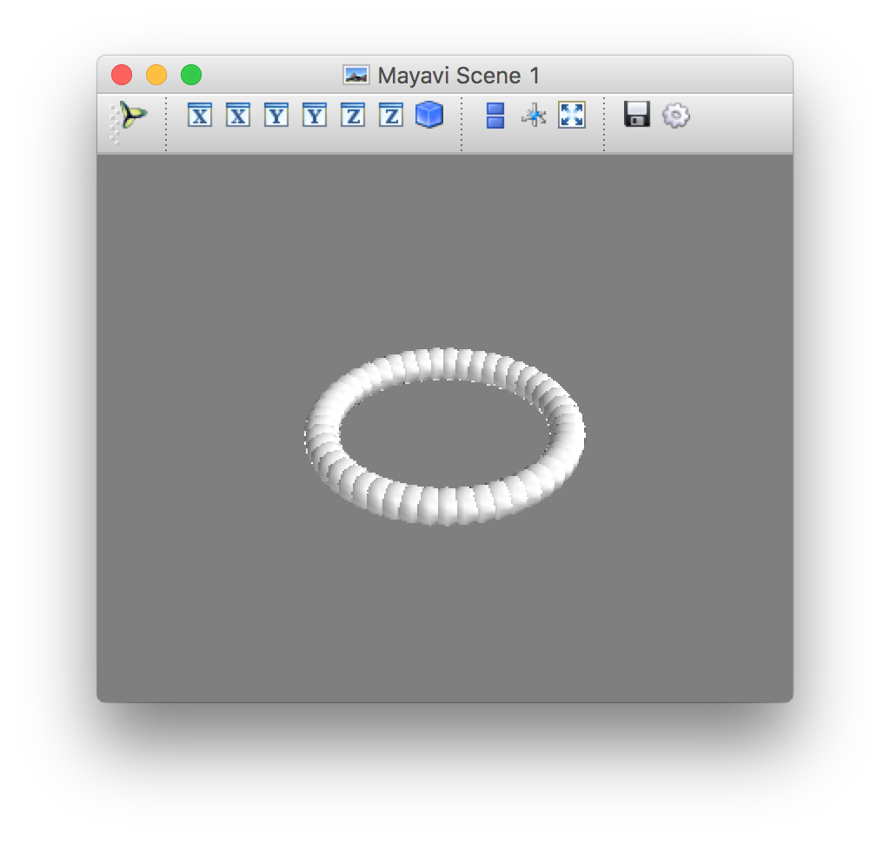
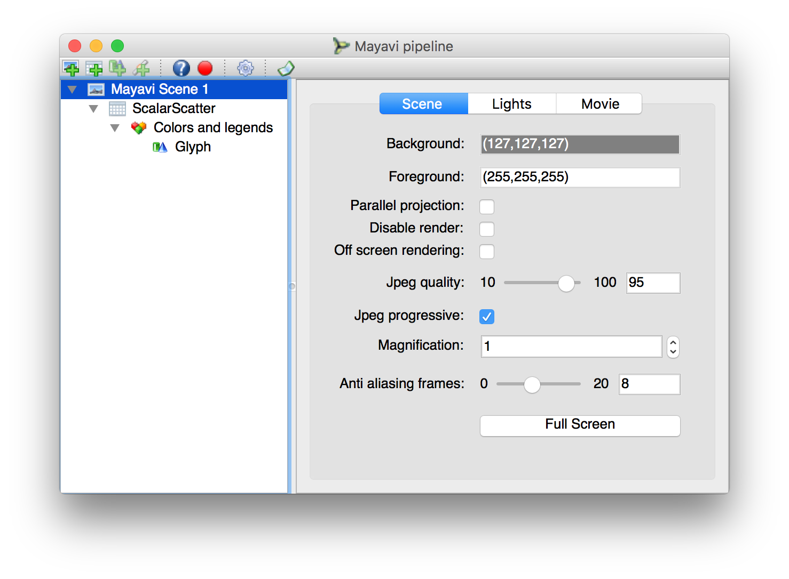
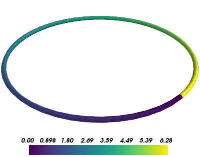

:author: Prabhu Ramachandran
:email: prabhu@aero.iitb.ac.in
:institution: Department of Aerospace Engineering
:institution: Indian Institute of Technology Bombay, Powai, Mumbai, India
:corresponding:

-------------------------------------------------
Mayavi: 3D Visualization and Plotting with Python
-------------------------------------------------

.. class:: abstract

   Mayavi_ is an open source, Python package for general-purpose 3D
   visualization. It uses the powerful VTK_ library and provides a Pythonic API
   to it. Mayavi provides a standalone application for visualizing data but more
   importantly provides a convenient high-level library for 3D visualization.
   The library integrates well with the Python stack and interfaces seamlessly
   with NumPy arrays. Mayavi provides a simple yet powerful entry-point for
   scientists via its ``mlab`` module which is similar in spirit to matplotlib's
   ``pylab`` module. Due to its use of VTK, Mayavi supports image data,
   structured grids, polygonal data, and unstructured grid datasets. A large
   number of visualization algorithms can be applied to data. Custom user
   interfaces that embed Mayavi plots can be easily made and these can be
   embedded into larger GUI applications that are written in either wxPython or
   Qt. Mayavi provides basic support for embedding interactive 3D plots inside
   Jupyter notebooks. In this chapter we introduce the reader to the Mayavi
   library by considering a simple application. We demonstrate how one can use
   the library to start with exploratory analysis, polish the visualization,
   animate it, and finally build a simple customized GUI application using the
   libary.

.. _Mayavi: http://code.enthought.com/projects/mayavi
.. _VTK: http://www.vtk.org

.. class:: keywords

   Visualization, Plotting, Python

Introduction
------------

Mayavi_ is a powerful general-purpose 3D visualization library. It provides
both a full-featured GUI in addition to a completely scriptable API. This
makes it easy for a casual user to start with a simple plot, refine it, and
then automate it. Mayavi uses the VTK_ library under the hood. This makes
Mayavi full-featured. VTK is a mature, respected, open source package for 3D
visualization that has been developed for over 2 decades. VTK is a very
powerful library provding functionality for visualization, imaging, and
graphics. It is implemented in C++ and provides over 2000 classes. While using
VTK does add a significant and complex dependency, the benefits are that the
user can use all of the features of VTK and any improvements to VTK are
available to Mayavi users. For example, with VTK 7.x and above, the
programmable OpenGL interface is used for visualization, providing an order of
magnitude (and sometimes even two orders of magnitude) speed improvements.
Mayavi hides many of the VTK details from the user and when it cannot hide
them it makes it easier to deal with. It also provides a convenient GUI so new
users can easily create and modify their visualizations. Furthermore, Mayavi
provides an automatic script recorder which can record all the UI actions and
provide executable Python code corresponding to those actions. This allows for
a user to explore and learn the scripting API as well as rapidly automate
their visualizations. Mayavi presents a Pythonic API and interfaces cleanly
with numpy_ arrays, making it a breeze to start with typical numerical data
and make visualizations.

.. _numpy: http://numpy.org

Mayavi uses the Enthought Tool Suite which provides a suite of tools to make
it easy for a typical scientist/engineer to create a user interface without
knowing the specifics of a particular GUI toolkit like Qt_ or wxPython_. This
makes it very easy to create fairly complex GUI applications which use the
full power of Mayavi and combine it with a custom UI, relatively easily.

.. _Qt: http://www.qt.io
.. _wxPython: http://www.wxpython.org

In the next section we explore the basic functionality that Mayavi provides to
rapidly visualize simple data. Thereafter we look at more complex datasets and
how they can be visualized, we then show simple examples of how one can build
a custom user interface embedding Mayavi.

Exploratory visualization
-------------------------

Mayavi's ``mlab`` module provides convenient functionality for exploratory
visualization of data. This module makes it easy to quickly visualize data and
is inspired by matplotlib's pylab. However, this module also provides complete
access to all of Mayavi's functionality. We now explore visualizing simple
data using this interface. To get started one may use the IPython_ console or
an IPython notebook as follows::

    $ ipython  # or
    $ jupyter console

    In [1]: %gui qt

It is important to set the ``%gui``, Mayavi works with both Qt and wxPython so
either option will work.

.. _IPython: http://ipython.org

The first simple example we consider is to show a collection of points in 3D.
Let us construct some simple data::

   import numpy as np
   t = np.linspace(0, 2*np.pi)
   x, y, z = np.sin(t), np.cos(t), np.zeros_like(t)

The arrays ``x, y, z`` represent points on the circumference of a circle. We
can easily plot these as follows::

   from mayavi import mlab
   mlab.points3d(x, y, z)

This produces the dialog shown in :ref:`fig:points3d`. One can interact with
the produced plot. One may interact using the mouse, keyboard, and the
toolbar. Using the mouse one can rotate the camera using left-click and drag,
pan the camera using Shift-Left-Click (or middle-click) and drag, zoom using
the wheel or by right clicking. The arrow keys can also be used to rotate the
camera, the +/- keys for zooming in and out and "Shift+Arrow" keys to pan. The
toolbar features several icons, the group of icons with X, Y, and Z can be
used to view the plot along the x, y, and z axes respectively and the last of
these provides an isometric view. The file icon on the right end is used to
either save the scene to a variety of file formats (various images, VRML, OBJ,
RIB, X3D, etc.). The right-most icon can be used to configure the background.

   Dialog produced by ``mlab.points3d``.  :label:`fig:points3d`

The icon on the left is the logo of Mayavi and clicking on this brings up the
Mayavi Pipeline Editor. Figure :ref:`fig:pipeline` shows the dialog produced.
On the left panel is a tree-view of the Mayavi pipeline which we discuss
later. On the right are widgets that are used to configure every object in the
Mayavi pipeline. The toolbar provides various conveniences. We look at the
pipeline in greater detail later on. For now, it is useful to understand that
at the root of the tree is a Mayavi Scene representing the area in which the
3D visualization is made. Below this is a "data source" node, in this case a
"ScalarScatter" which as its name describes represents the points we just
plotted. Below this is the "Colors and legends" node which allow us to
configure how the data is represented as colors. Below this is a "Glyph" node
which essentially plots some kind of shape at each of the points. As can be
seen from the plot, it appears as if a sphere has been placed at each point we
supplied to ``mlab.points3d``. One can click on any of these tree nodes to
configure the objects entirely graphically. This is a very powerful and useful
feature of Mayavi in that one does not need to learn an API to configure a
plot.

   The Mayavi Pipeline Editor.  :label:`fig:pipeline`

Just like matplotlib's ``pylab`` module, Mayavi also provides a ``clf``
function to clear the scene::

  mlab.clf()

This will clear out the scene and if one looks at the resulting "pipeline" the
scalar scatter node and everything under it has been removed. The ``points3d``
function also takes a variety of keyword arguments that are documented. These
may be perused using the IPython console/notebook. One extra argument that the
function takes is a ``scalars`` argument. Notice that the original plot did
not have any coloring, this was because we just plotted the points and there
were no scalar values associated with each point.  Had we done this::

  mlab.points3d(x, y, z, t)

Then we associate the value of t with each point and the resulting points
would be colored and scaled as per the value of the scalars. If we do not want
the scaling, we can try::

  mlab.clf()
  mlab.points3d(x, y, z, t, scale_mode='none')

This a typical workflow for a quick visualization and is very similar to what
many other two dimensional plotting utilities provide. Note that plots are by
default overlaid on top of each other which often necessitates a call to
``mlab.clf()``. Mayavi also provides an ``mlab.figure`` function analogous to
that provided by pylab to create multiple plots.

Mayavi provides several other options to visualize simple data and we take a
quick look at a few of these. If one wished to plot a line joining the points
we just created we could do::

  mlab.plot3d(x, y, z, t)

And this would produce a tube colored as per the local scalar value. One can
look at the legend with::

  mlab.scalarbar()

Note that most of the standard colormaps are provided, and one could do::

  mlab.plot3d(x, y, z, t, colormap='viridis')

to use the new ``viridis`` colormap resulting in Figure :ref:`fig:plot3d`.

   Result of ``mlab.plot3d`` with the viridis colormap.  :label:`fig:plot3d`

Other functions to mention with simple examples.

- surf
- mesh
- contour3d
- quiver
- flow

Animations.

Script recording and automation.

Loading some data.

More complex datasets
----------------------

Creating datasets with TVTK.

Custom UIs with Mayavi
-----------------------

Example of the PySPH viewer.

Future
------

Jupyter notebook support and future improvements.

Conclusions
-----------
