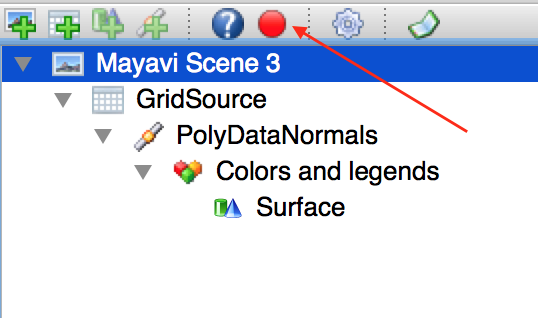
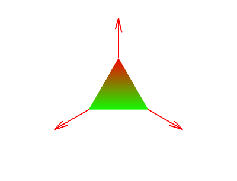

:author: Prabhu Ramachandran
:email: prabhu@aero.iitb.ac.in
:institution: Department of Aerospace Engineering,
   Indian Institute of Technology Bombay, Powai, Mumbai, India
:corresponding:

-------------------------------------------------
Mayavi: 3D Visualization and Plotting with Python
-------------------------------------------------

.. class:: abstract

   Mayavi_ is an open source, Python package for general-purpose 3D
   visualization. It uses the powerful VTK_ library and provides a Pythonic API
   to it. Mayavi provides a standalone application for visualizing data but more
   importantly provides a convenient high-level library for 3D visualization.
   The library integrates well with the Python stack and interfaces seamlessly
   with NumPy arrays. Mayavi provides a simple yet powerful entry-point for
   scientists via its ``mlab`` module which is similar in spirit to matplotlib's
   ``pylab`` module. Due to its use of VTK, Mayavi supports image data,
   structured grids, polygonal data, and unstructured grid datasets. A large
   number of visualization algorithms can be applied to data. Custom user
   interfaces that embed Mayavi plots can be easily made and these can be
   embedded into larger GUI applications that are written in either wxPython or
   Qt. Mayavi provides basic support for embedding interactive 3D plots inside
   Jupyter notebooks. In this chapter we introduce the reader to the Mayavi
   library by considering a simple application. We demonstrate how one can use
   the library to start with exploratory analysis, polish the visualization,
   animate it, and finally build a simple customized GUI application using the
   libary.

.. _Mayavi: http://code.enthought.com/projects/mayavi
.. _VTK: http://www.vtk.org

.. class:: keywords

   Visualization, Plotting, Python

Introduction
------------

Mayavi_ is a powerful general-purpose 3D visualization library. It provides
both a full-featured GUI in addition to a completely scriptable API. This
makes it easy for a casual user to start with a simple plot, refine it, and
then automate it. Mayavi uses the VTK_ library under the hood. This makes
Mayavi full-featured. VTK is a mature, respected, open source package for 3D
visualization that has been developed for over 2 decades. VTK is a very
powerful library provding functionality for visualization, imaging, and
graphics. It is implemented in C++ and provides over 2000 classes. While using
VTK does add a significant and complex dependency, the benefits are that the
user can use all of the features of VTK and any improvements to VTK are
available to Mayavi users. For example, with VTK 7.x and above, the
programmable OpenGL interface is used for visualization, providing an order of
magnitude (and sometimes even two orders of magnitude) speed improvements.
Mayavi hides many of the VTK details from the user and when it cannot hide
them it makes it easier to deal with. It also provides a convenient GUI so new
users can easily create and modify their visualizations. Furthermore, Mayavi
provides an automatic script recorder which can record all the UI actions and
provide executable Python code corresponding to those actions. This allows for
a user to explore and learn the scripting API as well as rapidly automate
their visualizations. Mayavi presents a Pythonic API and interfaces cleanly
with numpy_ arrays, making it a breeze to start with typical numerical data
and make visualizations.

.. _numpy: http://numpy.org

Mayavi uses the Enthought Tool Suite which provides a suite of tools to make
it easy for a typical scientist/engineer to create a user interface without
knowing the specifics of a particular GUI toolkit like Qt_ or wxPython_. This
makes it very easy to create fairly complex GUI applications which use the
full power of Mayavi and combine it with a custom UI, relatively easily.

.. _Qt: http://www.qt.io
.. _wxPython: http://www.wxpython.org

In the next section we explore the basic functionality that Mayavi provides to
rapidly visualize simple data. Thereafter we look at more complex datasets and
how they can be visualized, we then show simple examples of how one can build
a custom user interface embedding Mayavi.

Exploratory visualization
-------------------------

Mayavi's ``mlab`` module provides convenient functionality for exploratory
visualization of data. This module makes it easy to quickly visualize data and
is inspired by matplotlib's pylab. However, this module also provides complete
access to all of Mayavi's functionality. We now explore visualizing simple
data using this interface. To get started one may use the IPython_ console or
an IPython notebook as follows::

    $ ipython  # or
    $ jupyter console

    In [1]: %gui qt

It is important to set the ``%gui``, Mayavi works with both Qt and wxPython so
either option will work.

.. _IPython: http://ipython.org

The first simple example we consider is to show a collection of points in 3D.
Let us construct some simple data::

   import numpy as np
   t = np.linspace(0, 2*np.pi)
   x, y, z = np.sin(t), np.cos(t), np.zeros_like(t)

The arrays ``x, y, z`` represent points on the circumference of a circle. We
can easily plot these as follows::

   from mayavi import mlab
   mlab.points3d(x, y, z)

This produces the dialog shown in :ref:`fig:points3d`. One can interact with
the produced plot. One may interact using the mouse, keyboard, and the
toolbar. Using the mouse one can rotate the camera using left-click and drag,
pan the camera using Shift-Left-Click (or middle-click) and drag, zoom using
the wheel or by right clicking. The arrow keys can also be used to rotate the
camera, the +/- keys for zooming in and out and "Shift+Arrow" keys to pan. The
toolbar features several icons, the group of icons with X, Y, and Z can be
used to view the plot along the x, y, and z axes respectively and the last of
these provides an isometric view. The file icon on the right end is used to
save the scene to a variety of file formats (various images, VRML, OBJ, RIB,
X3D, etc.). The right-most icon can be used to configure the background.

.. figure:: images/points3d_simple.png
   :align: center

   Dialog produced by ``mlab.points3d``.  :label:`fig:points3d`

The icon on the left is the logo of Mayavi and clicking on this brings up the
Mayavi Pipeline Editor. Figure :ref:`fig:pipeline` shows the dialog produced.
On the left panel is a tree-view of the Mayavi pipeline which we discuss
later. On the right are widgets that are used to configure every object in the
Mayavi pipeline. The toolbar provides various conveniences. We look at the
pipeline in greater detail later on. For now, it is useful to understand that
at the root of the tree is a Mayavi Scene representing the area in which the
3D visualization is made. Below this is a "data source" node, in this case a
"ScalarScatter" which as its name describes represents the points we just
plotted. Below this is the "Colors and legends" node which allow us to
configure how the data is represented as colors. Below this is a "Glyph" node
which essentially plots some kind of shape at each of the points. As can be
seen from the plot, it appears as if a sphere has been placed at each point we
supplied to ``mlab.points3d``. One can click on any of these tree nodes to
configure the objects entirely graphically. This is a very powerful and useful
feature of Mayavi in that one does not need to learn an API to configure a
plot.

.. figure:: images/pipeline.png
   :align: center

   The Mayavi Pipeline Editor.  :label:`fig:pipeline`

Just like matplotlib's ``pylab`` module, Mayavi also provides a ``clf``
function to clear the scene::

  mlab.clf()

This will clear out the scene and if one looks at the resulting "pipeline" the
scalar scatter node and everything under it has been removed. The ``points3d``
function also takes a variety of keyword arguments that are documented. These
may be perused using the IPython console/notebook. One extra argument that the
function takes is a ``scalars`` argument. Notice that the original plot did
not have any coloring, this was because we just plotted the points and there
were no scalar values associated with each point.  Had we done this::

  mlab.points3d(x, y, z, t)

Then we associate the value of t with each point and the resulting points
would be colored and scaled as per the value of the scalars. If we do not want
the scaling, we can try::

  mlab.clf()
  mlab.points3d(x, y, z, t, scale_mode='none')

This a typical workflow for a quick visualization and is very similar to what
many other two dimensional plotting utilities provide. Note that plots are by
default overlaid on top of each other which often necessitates a call to
``mlab.clf()``. Mayavi also provides an ``mlab.figure`` function analogous to
that provided by pylab to create multiple plots.

Mayavi provides several other options to visualize simple data and we take a
quick look at a few of these. If one wished to plot a line joining the points
we just created we could do::

  mlab.plot3d(x, y, z, t)

And this would produce a tube colored as per the local scalar value. One can
look at the legend with::

  mlab.scalarbar()

Note that most of the standard colormaps are provided, and one could do::

  mlab.plot3d(x, y, z, t, colormap='viridis')

to use the new ``viridis`` colormap resulting in Figure :ref:`fig:plot3d`.

.. figure:: images/plot3d_viridis.png
   :align: center

   Result of ``mlab.plot3d`` with the viridis colormap.  :label:`fig:plot3d`

For two dimensional data with points that are rectilinear one can use
``mlab.surf``::

  x, y = np.mgrid[-3:3:100j,-3:3:100j]
  z = sin(x*x + y*y)
  mlab.surf(x, y, z)

This produces a carpet plot. Notice that the ``x, y`` are rectilinear.
Variants of this function are ``mlab.contour_surf`` which plots contours. For
points that are not rectilinear but are mappable to a rectilinear set of
points one can use ``mlab.mesh``.  For example::

   phi, theta = np.mgrid[0:pi:20j, 0:2*pi:20j]
   x = np.sin(phi)*np.cos(theta)
   y = np.sin(phi)*np.sin(theta)
   x = np.cos(phi)
   mlab.mesh(x, y, z, representation='wireframe')

plots the surface of a unit sphere using a wireframe.

For data with explicit topology like a set of triangles representing a
polygonal surface one can use ``mlab.triangular_mesh``.  For example::

   x, y, z = [[0., 1., 1], [0., 0, 1], [0., 0, 0]]
   t = [[0, 1, 2]]
   mlab.triangular_mesh(x, y, z, t)

Here, the triangles are explicitly specified by referring to indices in the
point arrays.  Images can also be rendered using ``mlab.imshow``. For example::

   s = np.random.random((2<<12, 2<<12))
   mlab.imshow(s)

For three-dimensional volumetric data that is rectilinear one could do::

   x, y, z = ogrid[-5:5:64j,-5:5:64j,-5:5:64j]
   mlab.contour3d(x*x*0.5 + y*y + z*z*2)

Thus far all the functions we have looked at dealt with scalar fields,
``mlab`` provides support for a few simple vector visualizations as well. For
example::

  x, y, z, u, v, w = np.random.random((6, 50))
  mlab.quiver3d(x, y, z, u, v, w)

Will plot arrows and works for any collection of points. For more structured
volumetric vector fields one can use ``mlab.flow`` which plots streamlines as
the following example demonstrates::

   x, y, z = mgrid[-2:3, -2:3, -2:3]
   r = sqrt(x**2 + y**2 + z**4)
   u = y*sin(r)/(r+0.001)
   v = -x*sin(r)/(r+0.001)
   w = zeros_like(z)
   obj = mlab.flow(x, y, z, u, v, w, seedtype='plane')

These basic functions are only a small subset of what Mayavi itself offers.
The simpler ``mlab`` functions only support a few limited options. Since
Mayavi is built on top of VTK, it supports structured grids, unstructured
grids, volume rendering, and simple tensor field visualization.

For example, building on the ``mlab.flow`` example above, one could do::

   vcp = mlab.pipeline.vector_cut_plane(obj)

and this would generate a cut plane through the vector field and show arrows
suitably oriented. Furthermore, one can use the UI to configure a variety of
parameters very easily. As a slightly more complex example, we can remove the
vector cut plane, extract the vector norm from the vector field, and show a
scalar cut plane using just a few lines of code::

   vcp.remove()
   scp = mlab.pipeline.scalar_cut_plane(
       mlab.pipeline.extract_vector_norm(obj)
   )

One could also have done this on the pipeline editor UI by right clicking on
an appropriate node and choosing one of the Mayavi filters or modules.

In addition to these functions, there are also several other utility functions
that are similar in usage to those available in ``pylab``:

- ``mlab.gcf``
- ``mlab.savefig``
- ``mlab.figure``
- ``mlab.axes``, ``mlab.outline``
- ``mlab.title``, ``mlab.xlabel``, ``mlab.ylabel``, ``mlab.zlabel``
- ``mlab.colorbar``, ``mlab.scalarbar``, ``mlab.vectorbar``
- ``mlab.show``
- ``mlab.text3d, mlab.orientation_axes``
- ``mlab.show_pipeline``
- ``mlab.view, mlab.roll, mlab.yaw, mlab.move``

More information is available on these in the user guide. There are also
several functions provided in ``mlab`` module (``mlab.test_*``) that provide
convenient examples to get started with mlab. Users can look at the source of
these functions and execute them to quickly look at useful examples.

Simple Animations
~~~~~~~~~~~~~~~~~~

``mlab`` makes it easy to perform simple animations, for example::

  x, y = np.mgrid[0:3:1, 0:3:1]
  s = mlab.surf(x, y, x*0.1)
  for i in range(10):
      s.mlab_source.scalars = x*0.1*(i + 1)

The first few lines show a plane with a slight elevation. The ``for`` loop
automatically updates the visualization to rotate the plane about the y axis.
The ``mlab_source`` attribute is a special attribute that is specific to the
simple visualizations produced using ``mlab``. One could also change ``x, y``,
and ``scalars`` together using the ``s.mlab_source.set`` method.

Sometimes, one may wish to change the shape of the data, for example if the
mesh defining the points itself changes, just calling ``mlab_source.set`` is
not enough and one should call ``mlab_source.reset``. Unfortunately, if one
were to run this, the visualization would not produce a smooth animation due
to the GUI toolkit mainloop, ``mlab`` provides a convenient decorator for
this, and converting the above into a simple generator facilitates this::

  @mlab.animate
  def anim():
      x, y = np.mgrid[0:3:1, 0:3:1]
      s = mlab.surf(x, y, x*0.1)
      for i in range(10):
          s.mlab_source.scalars = x*0.1*(i + 1)
          yield

  anim()

This will interact with the GUI toolkits mainloop smoothly. Automatically
saving a screenshot of the animation is also possible in this case, for
example::

  f = mlab.figure()
  f.scene.movie_maker.record = True
  anim()

Will automatically save each iteration of the for loop into an image located
in ``~/Documents/mayavi_movies``. This can be configured.

Loading file data
~~~~~~~~~~~~~~~~~

These are not the only things one can do with Mayavi, VTK supports reading a
variety of different file formats. Mayavi supports a subset of these and any
supported file can be opened by simply doing::

  src = mlab.pipeline.open('filename.ext')

Once the data is loaded one may apply a variety of filters and visualization
modules to this data with Mayavi. Currently, Mayavi supports over 40 different
file formats, these include a variety of image file formats, a variety of
polygonal files like 3D Studio files, VRML, OBJ, STL, and the various VTK
files.

Doing more with automation
~~~~~~~~~~~~~~~~~~~~~~~~~~~

Mayavi can be fairly complex given the vast number of options that each
visualization can often require. While it is easy to quickly whip up a pretty
visualization using the UI, this does not lend itself for automated plots
which are extremely important for scripting and reproducibility. Mayavi
provides a very powerful feature called automatic script recording. On the
pipeline dialog, one can click on the red record button shown in the figure
below.

   Record button for automatic script recording.  :label:`fig:record`

When one does this, a text window is shown where one can see the Python code
for each action performed on the UI. This code is typically executable and can
be cut/paste to generate a Python script for the visualization. This is
convenient both for automation and also to learn the Mayavi API. One could
also turn on the script recording by doing::

    mlab.start_recording()

and turn it off using `mlab.stop_recording()`. This also takes a parameter
that allows one to save the resulting script to a file.

These features make Mayavi a powerful visualization tool in the hands of
novice and advanced users.

Preparing data for visualization: making datasets
--------------------------------------------------

The various ``mlab`` commands internally create VTK datasets in order to
visualize them. It is important to understand why the notion of "datasets" is
so important in three dimensional data visualization.

As a simple example, consider the set of points generated by the following code::

  phi, theta = np.mgrid[0:pi:20j, 0:2*pi:20j]
  x = np.sin(phi)*np.cos(theta)
  y = np.sin(phi)*np.sin(theta)
  x = np.cos(phi)

One could think of visualizing these as:

- a collection of points on the surface of a sphere.
- a set of lines connecting these points that lie on the surface of a sphere.
- a set of triangles representing the surface of the sphere.
- a set of tetrahedron that represent the interior of the sphere.

Clearly, the points alone do not provide enough information. We need to know
how these points are connected and what they form when they are connected.
This topological information is what often makes specification of the data for
3D visualization a bit challenging.

When the points are uniformly placed or are mappable to a regular mesh of
points it is easy to define the topology implicitly but when the points are
disorganized as in the case of the following points::

  x, y, z = np.random.random((3, 100))

it is not easy to automatically determine the connectivity and the topology
must be explicitly specified.

``mlab`` provides a fair amount of functionality to deal with uniformly spaced
points with an implicit topology or for completely disorganized points. For
simple cases like a set of lines, and for triangles, ``mlab`` provides
convenient functions. For more complex datasets one needs to use the
lower-level VTK data structures. Mayavi provides a powerful wrapper to the
underlying VTK data structures through the ``tvtk`` package. We first go over
the basic functions that ``mlab`` provides and then show a few high-level
examples of more complex datasets that can be created with ``tvtk``.

Given a set of points, one can categorize the connectivity between them in the
following ways as seen before:

- unconnected points.
- implicit connectivity of points.
- explicit connectivity of points.

``mlab.pipeline`` provides for each of these using the following functions
which can be used to create datasets of

- unconnected: ``scalar_scatter``, ``vector_scatter``.
- implicitly connected: ``scalar_field``, ``vector_field, array2d_source``,
- explicitly connected: ``line_source``, ``triangular_mesh_source``

For example, if we wished to visualize the data of a set of arbitrary points::

  x, y, z, temp = np.random.random((4, 100))
  src = mlab.pipeline.scalar_scatter(x, y, z, temp)
  g = mlab.pipeline.glyph(
      src, scale_mode='none', scale_factor=0.1
  )

This will plot spheres at each of the points, colored by the temperature. The
``scalar_scatter`` creates a suitable dataset. When one uses
``mlab.points3d``, it uses ``scalar_scatter`` internally. Similarly, the other
``mlab`` functions use different functions to create suitable data sources.

In addition to these simple datasets, VTK also provides a structured grid and
an unstructured grid dataset. These cannot be created with ``mlab`` directly
but may be created using TVTK. A structured grid is one with an implicit
ordering of points, i.e. the points map to a set of indices ``i, j, k`` and
the connectivity is therefore implicit. In an unstructured grid, one must
explicitly specify the connectivity. This is similar to the
``mlab.triangular_mesh`` example we looked at earlier which we recall here::

   x, y, z = [[0., 1., 1], [0., 0, 1], [0., 0, 0]]
   t = [[0, 1, 2]]
   mlab.triangular_mesh(x, y, z, t)

Notice that here the triangle is explicitly specified. In a similar fashion
one could create an unstructured grid.  Consider the following code::

  from tvtk.api import tvtk
  points = array([[0.,0,0], [1,0,0], [0,1,0], [0,0,1]])
  tets = array([[0, 1, 2, 3]])
  tet_type = tvtk.Tetra().cell_type # VTK_TETRA == 10

  ug = tvtk.UnstructuredGrid(points=points)
  ug.set_cells(tet_type, tets)
  # Attribute data.
  temperature = array([10, 20 ,20, 30], 'f')
  ug.point_data.scalars = temperature
  ug.point_data.scalars.name = 'temperature'

Here the first four lines define the points and the ``tets`` attribute
specifies which points constitute the tetrahedron, and the ``tet_type`` is
what tells VTK what "cell type" this data is. The next line constructs the
underlying VTK unstructured grid object using a very Python-friendly syntax.
This can be extended to specify a large number of tetrahedron or other cell
type. This allows a user to create fairly complex datasets and visualize them.

We can also add vector data to the points using the following::

  velocity = array([[0.,0,0], [1,0,0],[0,1,0],[0,0,1]])
  ug.point_data.vectors = velocity
  ug.point_data.vectors.name = 'velocity'

We can easily visualize this with Mayavi using the following::

  src = mlab.pipeline.add_dataset(ug)
  surf = mlab.pipeline.surface(src)
  vec = mlab.pipeline.vectors(src)

Producing the following image.

   Visualization of a single tetrahedron that is part of an unstructured grid.
   The dataset also has scalar and vector attributes associated with the
   points. :label:`fig:ug`

It should be noted that if one only has a set of disorganized points with a
set of scalars or vectors but without any connectivity information, it is
possible to build a mesh out of these points. VTK provides a simple 2D and 3D
Delaunay triangulation algorithm for this. For example let us say we have the
following points and scalars::

  x, y, z = np.random.random((3, 1000))
  s = x*x + y*y + z*z/2

We could load this data up as a set of scattered points with::

  src = mlab.pipeline.scalar_scatter(x, y, z, s)

Unfortunately, since these just represent a set of points, one cannot
visualize say, iso-contours of the scalar field. This requires data to be in
the form of an unstructured mesh. To do this, one could run a Delaunay 3D
filter on the data and visualize iso-contours of the resulting scalar field::

  ug = mlab.pipeline.delaunay3d(src)
  iso = mlab.pipeline.iso_surface(ug, contours=8)

Thus, one could either setup the datasets manually or use some approach like
this to generate a suitable dataset and then visualize it very easily with Mayavi.

- Mouse-click interactions.

Custom UIs with Mayavi
-----------------------

Example of the PySPH viewer.

Future
------

Jupyter notebook support and future improvements.

Conclusions
-----------
