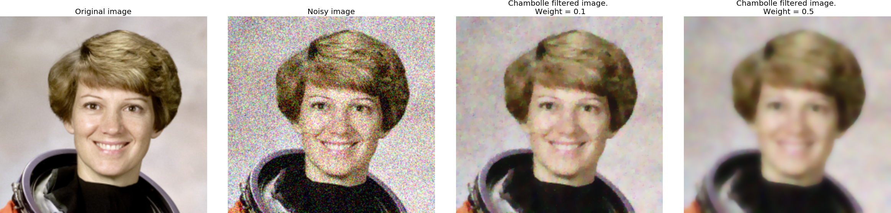
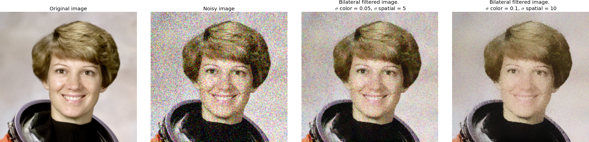
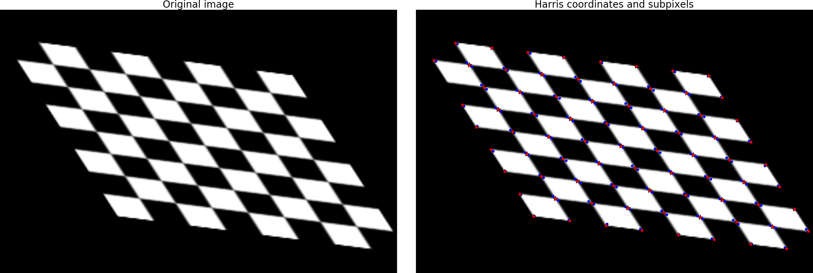

scikit-image (provisory title)
==============================

:author: Stéfan van der Walt
:email: stefanv@berkeley.edu
:institution: Berkeley Institute for Data Science, University of California at Berkeley, USA
:corresponding:

:author: Emmanuelle Gouillart
:email: emmanuelle.gouillart@nsup.org
:institution: Joint Unit CNRS/Saint-Gobain Surface of Glass and Interfaces, Aubervilliers, France
:equal-contributor:

:author: Alexandre F. de Siqueira
:email: alexandredesiqueira@programandociencia.com
:institution: University of Campinas, Campinas, Brazil
:institution: TU Bergakademie Freiberg, Freiberg, Germany
:equal-contributor:

:author: Egor Panfilov
:email:
:institution:
:equal-contributor:

:author: Joshua D. Warner
:email: joshua.dale.warner@gmail.com
:institution: Mayo Clinic, Rochester, USA
:equal-contributor:

.. class:: abstract

scikit-image is an image processing library that implements algorithms
and utilities for use in research, education and industry applications.
It is released under the liberal Modified BSD open source license,
provides a well-documented API in the Python programming language, and
is developed by an active, international team of collaborators. In this
paper we highlight the advantages of open source to achieve the goals of
the scikit-image library, and we showcase several real-world image
processing applications that use scikit-image. More information can be
found on the project homepage, http://scikit-image.org.

.. class:: keywords

image processing, computer vision, python

Introduction
------------

scikit-image is an image processing....

Mention how ndarray allows us to fit in with rest of eco-system

Parallel & distributed processing via dask

Usage examples
--------------

Reducing noise
~~~~~~~~~~~~~~

In this example, we denoise a noisy part of ``astronaut``, the picture
of the astronaut Eileen Collins. For that end we use three different
filters implemented in scikit-image: total variation, bilateral, and
wavelets.

These algorithms typically produce “posterized” images, with flat
domains separated by sharp edges. It is possible to control the tradeoff
between denoising and faithfulness to the original image, controlling
the degree of posterization according to the function arguments.

To start this example, the ``data`` module is imported. It contains the
test images available in scikit-image. We also need the function
``img_as_float``, which converts the input image into the interval [0,
1]. After that, the variable ``img_astro`` receives the image
``astronaut``, and we obtain a piece of that image. Then, we use the
function ``random_noise`` from the module ``util`` to generate a noisy
version of ``img_astro``, according to a stablished value for sigma.

.. code:: python

    from skimage import data, img_as_float
    from skimage.util import random_noise

    img_astro = img_as_float(data.astronaut())
    img_astro = img_astro[0:220, 100:330]

    sigma = 0.15
    img_noisy = random_noise(img_astro, var=sigma**2)

Here ``img_noisy`` receives the noisy version of ``img_astro``. The
variance of the random distribution used to generate the noise,
represented as ``var`` in ``random_noise``, is defined by the stablished
value for sigma squared (``sigma**2``).

Total variation filter
^^^^^^^^^^^^^^^^^^^^^^

The total variation filter returns an image with minimal total variation
norm, while being as close as possible to the initial image. The total
variation norm is given as the L1 norm of the image gradient. This
filter tends to produce piecewise-constant ("cartoon-like") images.

There are two implementations of total variation filters on
scikit-image: split-Bregman [REF: Getreuer, 2012] and Chambolle [REF:
Chambolle, 2004]. We use the latter in this example: it is given by the
function ``denoise_tv_chambolle``, contained in the module
``restoration``.

.. code:: python

    from skimage.restoration import denoise_tv_chambolle

    img_chamlow = denoise_tv_chambolle(img_noisy,
                                       weight=0.1,
                                       multichannel=True)
    img_chamhigh = denoise_tv_chambolle(img_noisy,
                                        weight=0.5,
                                        multichannel=True)

The function ``denoise_tv_chambolle`` accepts several parameters, in
which we used ``weight`` and ``multichannel``: \* ``weight`` represents
the denoising weight: the greater the weight, the higher the denoising
(at the expense of fidelity to the input image). \* ``multichannel``, by
its turn, enables the option to apply total-variation denoising
separately for each color channel. This parameter should receive
``True`` for color input image; if not, the denoising operation is
applied also in channels dimension.

The variables ``img_chamlow`` and ``img_chamhigh`` receive
``denoise_tv_chambolle`` weights equal to ``0.1`` and ``0.5``,
respectively. After that we use the module ``pyplot`` from Matplotlib
[REF] to check the denoising results.

.. code:: python

    import matplotlib.pyplot as plt

    plt.figure(figsize=(20, 12))

    plt.subplot(141)
    plt.imshow(img_astro)
    plt.title('Original image')
    plt.axis('off')

    plt.subplot(142)
    plt.imshow(img_noisy)
    plt.title('Noisy image')
    plt.axis('off')

    plt.subplot(143)
    plt.imshow(img_chamlow)
    plt.title('Chambolle filtered image. \n Weight = 0.1')
    plt.axis('off')

    plt.subplot(144)
    plt.imshow(img_chamhigh)
    plt.title('Chambolle filtered image. \n Weight = 0.5')
    plt.axis('off')

    plt.tight_layout()
    plt.show()

    Examples on TV Chambolle's denoising.
    Note that the higher weight produces a smoother image.

Bilateral filter
^^^^^^^^^^^^^^^^

A bilateral filter [REF: Tomasi, Manduchi, 1998] reduces noise while
preserving edges. It averages pixels based on their spatial closeness
and radiometric similarity. The bilateral filter is implemented by the
function ``denoise_bilateral``, contained in the module ``restoration``.

.. code:: python

    from skimage.restoration import denoise_bilateral

    img_billow = denoise_bilateral(img_noisy,
                                   sigma_color=0.05,
                                   sigma_spatial=5)
    img_bilhigh = denoise_bilateral(img_noisy,
                                    sigma_color=0.1,
                                    sigma_spatial=10)

``denoise_bilateral`` also accepts several arguments. Here we use
``sigma_color`` and ``sigma_spatial``: \* ``sigma_color`` represents the
radiometric similarity, i.e. the standard deviation for color/shade
distance. The result is in respect to the interval [0, 1] If it receives
the value ``None``, the standard deviation of the input image is used.
\* ``sigma_spatial`` is the standard deviation for range distance. A
larger value results in averaging of pixels with larger spatial
differences.

The variable ``img_billow`` receives smaller ``sigma_color`` and
``sigma_spatial`` when compared to ``img_bilhigh``. The results are
shown using Matplotlib's ``pyplot``.

.. code:: python

    import matplotlib.pyplot as plt

    plt.figure(figsize=(20, 12))

    plt.subplot(141)
    plt.imshow(img_astro)
    plt.title('Original image')
    plt.axis('off')

    plt.subplot(142)
    plt.imshow(img_noisy)
    plt.title('Noisy image')
    plt.axis('off')

    plt.subplot(143)
    plt.imshow(img_billow)
    plt.title('Bilateral filtered image. \n\
              $\sigma$ color = 0.05, $\sigma$ spatial = 5')
    plt.axis('off')

    plt.subplot(144)
    plt.imshow(img_bilhigh)
    plt.title('Bilateral filtered image. \n\
              $\sigma$ color = 0.1, $\sigma$ spatial = 10')
    plt.axis('off')

    plt.tight_layout()
    plt.show()

    Examples on bilateral denoising. Higher sigmas
    produce a smoother image. Compare with TV Chambolle's results.

Detecting corners
~~~~~~~~~~~~~~~~~

Corner detection is used to extract features and infer the contents of
an input image. There are several corner detectors implemented on
scikit-image. In this example we use one of them, the Harris corner
detector [REF], to detect corner points and determine their subpixel
position.

First we generate the input image. It is based on an image of a
checkerboard, given by the function ``data.checkerboard()``. Using the
functions ``warp`` and ``AffineTransform`` contained in the module
``transform``, we can geometrically manipulate the input image.

.. code:: python

    from skimage import data
    from skimage.transform import warp, AffineTransform

    affine = AffineTransform(scale=(0.8, 1.1),
                             rotation=1,
                             shear=0.7,
                             translation=(220, 50))
    image = warp(data.checkerboard(),
                 affine.inverse,
                 output_shape=(200, 300))

Then we import the functions ``corner_harris``, ``corner_subpix`` and
``corner_peaks``, from the module ``feature``: \* ``corner_harris``
compute the Harris corner measure response image. \* ``corner_peaks``
find corners in the corner measure response image. \* ``corner_subpix``
determine the subpixel position of corners.

.. code:: python

    from skimage.feature import corner_harris, corner_subpix, corner_peaks

    harris_coords = corner_peaks(corner_harris(image))
    harris_subpix = corner_subpix(image, harris_coords)

Here, ``harris_coords`` and ``harris_subpix`` contain the coordinates of
each corner found by Harris detector, and their subpixel position. Using
Matplotlib's ``pyplot`` we can check the results. The ``plot`` function,
from ``pyplot``, is used to plot the corner points on the original
image.

.. code:: python

    import matplotlib.pyplot as plt

    fig, ax = plt.subplots(1, 2)
    ax[0].imshow(image, cmap='gray')
    ax[0].set_title('Original image', fontsize=20)
    ax[0].axis((0, 299, 199, 0))
    ax[0].axis('off')

    ax[1].imshow(image, cmap='gray')
    ax[1].plot(harris_coords[:, 1], harris_coords[:, 0],
               '.b', markersize=10)
    ax[1].plot(harris_subpix[:, 1], harris_subpix[:, 0],
               '*r', markersize=10)
    ax[1].set_title('Harris coordinates and subpixels',
                    fontsize=20)
    ax[1].axis((0, 299, 199, 0))
    ax[1].axis('off')
    plt.show()

    Corners of the original image determined by Harris corner detector.
    Red stars and blue dots represent the corners and their
    subpixel position, respectively.

Detecting edges
~~~~~~~~~~~~~~~

Panorama Stitching
~~~~~~~~~~~~~~~~~~

This example stitches three images into a seamless panorama using
several tools in scikit-image, including feature detection, RANdom
SAmple Consensus (RANSAC), graph theory, and affine transformations. The
images used in this example are available at
https://github.com/scikit-image/skimage-tutorials/tree/master/images/pano
named ``JDW_9*.jpg``.

Load images
^^^^^^^^^^^

The ``io`` module in scikit-image allows images to be loaded and saved.
In this case the color panorama images will be loaded into an iterable
``ImageCollection``, though one could also load them individually.

.. code:: python

    from skimage import io
    pano_images = io.ImageCollection('/path/to/images/JDW_9*')

.. figure:: https://i.imgur.com/bMCHhr5.jpg

    Panorama source images, taken on the trail to
    Delicate Arch in Arches National Park, USA.
    Released under CC-BY 4.0 by Joshua D. Warner.

Feature detection and matching
^^^^^^^^^^^^^^^^^^^^^^^^^^^^^^

To correctly align the images, a *projective* transformation relating
them is required. 1. Define one image as a *target* or *destination*
image, which will remain anchored while the others are warped. 2. Detect
features in all three images. 3. Match features from left and right
images against the features in the center, anchored image.

In this series, the middle image is the logical anchor point. Numerous
feature detection algorithms are available; this example will use
Oriented FAST and rotated BRIEF (ORB) features available as
``skimage.feature.ORB``\ [REFERENCE DOI 10.1109/ICCV.2011.6126544 and/or
PDF at the authors' site
http://www.willowgarage.com/sites/default/files/orb\_final.pdf]. Note
that ORB requires grayscale images.

.. code:: python

    from skimage.color import rgb2gray
    from skimage.feature import ORB, match_descriptors, plot_matches

    # Initialize ORB
    orb = ORB(n_keypoints=800, fast_threshold=0.05)
    keypoints = []
    descriptors = []

    # Detect features
    for image in pano_images:
        orb.detect_and_extract(rgb2gray(image))
        keypoints.append(orb.keypoints)
        descriptors.append(orb.descriptors)

    # Match features from images 0 -> 1 and 2 -> 1
    matches01 = match_descriptors(descriptors[0], descriptors[1], cross_check=True)
    matches12 = match_descriptors(descriptors[1], descriptors[2], cross_check=True)

    # Show raw matched features
    fig, ax = plt.subplots()
    plot_matches(ax, pano_images[0], pano_images[1], keypoints[0], keypoints[1], matches01)
    ax.axis('off');
    fig.savefig('./raw_matched.png', dpi=500, pad_inches=0, bbox_inches='tight')

.. figure:: https://i.imgur.com/5Q4zz5k.jpg

    Matched ORB keypoints from left and center images to
    be stitched. Most features line up similarly, but there are a number of
    obvious outliers or false matches.

Transform estimation
^^^^^^^^^^^^^^^^^^^^

To filter out the false matches observed in [FIGREF PRIOR], RANdom
SAmple Consensus (RANSAC) is used [REFERENCE]. RANSAC is a powerful
method of rejecting outliers available in ``skimage.transform.ransac``.
The transformation is estimated using an iterative process based on
randomly chosen subsets, finally selecting the model which corresponds
best with the majority of matches.

It is important to note the randomness inherent to RANSAC. The results
are robust, but will vary slightly every time. Thus, it is expected that
the readers' results will deviate slightly from the published figures
after this point.

.. code:: python

    from skimage.measure import ransac
    from skimage.transform import ProjectiveTransform

    # Keypoints from left (source) to middle (destination) images
    src = keypoints0[matches01[:, 0]][:, ::-1]
    dst = keypoints1[matches01[:, 1]][:, ::-1]

    model_ransac01, inliers01 = ransac((src, dst), ProjectiveTransform,
                                       min_samples=4, residual_threshold=1, max_trials=300)

    # Keypoints from right (source) to middle (destination) images
    src = keypoints2[matches12[:, 1]][:, ::-1]
    dst = keypoints1[matches12[:, 0]][:, ::-1]

    model_ransac12, inliers12 = ransac((src, dst), ProjectiveTransform,
                                       min_samples=4, residual_threshold=1, max_trials=300)

    # Show robust, RANSAC-matched features
    fig, ax = plt.subplots()
    plot_matches(ax, pano_images[0], pano_images[1],
                 keypoints[0], keypoints[1], matches01[inliers01])
    ax.axis('off');

.. figure:: https://i.imgur.com/qBuIHO5.jpg

    The best RANSAC transform estimation uses only these
    keypoints. The outliers are now excluded.

Warp images into place
^^^^^^^^^^^^^^^^^^^^^^

Before producing the panorama, the correct size for a new canvas to hold
all three warped images is needed. The entire size, or extent, of this
image is carefully found.

.. code:: python

    from skimage.transform import SimilarityTransform

    # All three images have the same size
    r, c = pano_images[1].shape[:2]

    # Note that transformations take coordinates in (x, y) format,
    # not (row, column), in order to be consistent with most literature
    corners = np.array([[0, 0],
                        [0, r],
                        [c, 0],
                        [c, r]])

    # Warp image corners to their new positions
    warped_corners01 = model_ransac01(corners)
    warped_corners12 = model_ransac12(corners)

    # Extents of both target and warped images
    all_corners = np.vstack((warped_corners01, warped_corners12, corners))

    # The overall output shape will be max - min
    corner_min = np.min(all_corners, axis=0)
    corner_max = np.max(all_corners, axis=0)
    output_shape = (corner_max - corner_min)

    # Ensure integer shape with np.ceil and dtype conversion
    output_shape = np.ceil(output_shape[::-1]).astype(int)

Next, each image is warped and placed into a new canvas of shape
``output_shape``.

Translate middle target image
'''''''''''''''''''''''''''''

The middle image is stationary, but still needs to be shifted into the
center of the larger canvas. This is done with simple translation.

.. code:: python

    from skimage.transform import warp, SimilarityTransform

    offset1 = SimilarityTransform(translation= -corner_min)

    # Translate pano1 into place
    pano1_warped = warp(pano_images[1], offset1.inverse, order=3,
                        output_shape=output_shape, cval=-1)

    # Acquire the image mask for later use
    pano1_mask = (pano1_warped != -1)[..., 0]  # Mask == 1 inside image
    pano1_warped[~pano1_mask] = 0              # Return background values to 0

Apply RANSAC-estimated transforms
'''''''''''''''''''''''''''''''''

The other two images are warped by ``ProjectiveTransform`` into place.

.. code:: python

    # Warp left image
    transform01 = (model_ransac01 + offset1).inverse
    pano0_warped = warp(pano_images[0], transform01, order=3,
                        output_shape=output_shape, cval=-1)

    pano0_mask = (pano0_warped != -1)[..., 0]  # Mask == 1 inside image
    pano0_warped[~pano0_mask] = 0              # Return background values to 0

    # Warp right image
    transform12 = (model_ransac12 + offset1).inverse
    pano2_warped = warp(pano_images[2], transform12, order=3,
                        output_shape=output_shape, cval=-1)

    pano2_mask = (pano2_warped != -1)[..., 0]  # Mask == 1 inside image
    pano1_warped[~pano1_mask] = 0              # Return background values to 0

.. figure:: https://i.imgur.com/a6tHXbP.jpg

    Each image is now correctly warped into the new
    frame, ready to be combined/stitched together.

Image stitching using minimum-cost path
^^^^^^^^^^^^^^^^^^^^^^^^^^^^^^^^^^^^^^^

Because of optical non-linearities, simply averaging these images
together will not work. The overlapping areas become significantly
blurred. Instead, a minimum-cost path can be found with the assistance
of ``skimage.graph.route_through_array``. This function allows one to

-  start at any point on an array
-  find a particular path to any other point in the array
-  the path found *minimizes* the sum of values on the path.

The array in this instance is a *cost array*, while the path is the
*minimum-cost path*, or MCP. To use this technique we need starting and
ending points, as well as a cost array.

Define seed points
''''''''''''''''''

.. code:: python

    ymax = output_shape[1] - 1
    xmax = output_shape[0] - 1

    # Start anywhere along the top and bottom, left of center.
    mask_pts01 = [[0,    ymax // 3],
                  [xmax, ymax // 3]]

    # Start anywhere along the top and bottom, right of center.
    mask_pts12 = [[0,    2*ymax // 3],
                  [xmax, 2*ymax // 3]]

Construct cost array
''''''''''''''''''''

For optimal results, great care goes into the creation of the cost
array. The function below is designed to construct the best possible
cost array. Its tasks are:

1. Start with a high-cost image filled with ones.
2. Use the mask - which defines where the overlapping region will be -
   to find the distance from the top/bottom edges to the masked area.
3. Reject mostly vertical areas.
4. Give a cost break to areas slightly further away, if the warped
   overlap is not parallel with the image edges, to ensure fair
   competition
5. Put the absolute value of the *difference* of the overlapping images
   in place

**[CONSIDER PLACING THIS UTILITY FUNCTION IN AN APPENDIX - IF WE CAN, WE
SHOULD ALSO PUT FLOOD FILL THERE]**

.. code:: python

    from skimage.measure import label

    def generate_costs(diff_image, mask, vertical=True, gradient_cutoff=2.,
                       zero_edges=True):
        """
        Ensures equal-cost paths from edges to region of interest.
        
        Parameters
        ----------
        diff_image : (M, N) ndarray of floats
            Difference of two overlapping images.
        mask : (M, N) ndarray of bools
            Mask representing the region of interest in ``diff_image``.
        vertical : bool
            Control if stitching line is vertical or horizontal.
        gradient_cutoff : float
            Controls how far out of parallel lines can be to edges before
            correction is terminated. The default (2.) is good for most cases.
        zero_edges : bool
            If True, the edges are set to zero so the seed is not bound to 
            any specific horizontal location.
            
        Returns
        -------
        costs_arr : (M, N) ndarray of floats
            Adjusted costs array, ready for use.
        """
        if vertical is not True:  # run transposed
            return tweak_costs(diff_image.T, mask.T, vertical=True,
                               gradient_cutoff=gradient_cutoff).T
        
        # Start with a high-cost array of 1's
        diff_image = rgb2gray(diff_image)
        costs_arr = np.ones_like(diff_image)
        
        # Obtain extent of overlap
        row, col = mask.nonzero()
        cmin = col.min()
        cmax = col.max()

        # Label discrete regions
        cslice = slice(cmin, cmax + 1)
        labels = label(mask[:, cslice], background=-1)
        
        # Find distance from edge to region
        upper = (labels == 1).sum(axis=0)
        lower = (labels == 3).sum(axis=0)
        
        # Reject areas of high change
        ugood = np.abs(np.gradient(upper)) < gradient_cutoff
        lgood = np.abs(np.gradient(lower)) < gradient_cutoff
        
        # Give areas slightly farther from edge a cost break
        costs_upper = np.ones_like(upper, dtype=np.float64)
        costs_lower = np.ones_like(lower, dtype=np.float64)
        costs_upper[ugood] = upper.min() / np.maximum(upper[ugood], 1)
        costs_lower[lgood] = lower.min() / np.maximum(lower[lgood], 1)
        
        # Expand from 1d back to 2d
        vdist = mask.shape[0]
        costs_upper = costs_upper[np.newaxis, :].repeat(vdist, axis=0)
        costs_lower = costs_lower[np.newaxis, :].repeat(vdist, axis=0)
        
        # Place these in output array
        costs_arr[:, cslice] = costs_upper * (labels == 1)
        costs_arr[:, cslice] +=  costs_lower * (labels == 3)
        
        # Finally, place the difference image
        costs_arr[mask] = np.abs(diff_image[mask])
        
        if zero_edges is True:  # set top & bottom edges to zero
            costs_arr[0, :] = 0
            costs_arr[-1, :] = 0

        return costs_arr
        
        
    # Use this function
    costs01 = generate_costs(pano0_warped - pano1_warped,
                             pano0_mask & pano1_mask)
    costs12 = generate_costs(pano1_warped - pano2_warped,
                             pano1_mask & pano2_mask)

Find minimum-cost path and masks
''''''''''''''''''''''''''''''''

Once the cost function is generated, the minimum cost path can be found
simply and efficiently.

.. code:: python

    from skimage.graph import route_through_array

    # Find the MCP
    pts01, _ = route_through_array(costs01, mask_pts01[0], mask_pts01[1], 
                                   fully_connected=True)
    pts01 = np.array(pts01)

    # Create final mask for the left image
    mask0 = np.zeros_like(pano0_warped[..., 0], dtype=np.uint8)
    mask0[pts01[:, 0], pts01[:, 1]] = 1
    mask0 = (label(mask0, connectivity=1, background=-1) == 1)

.. figure:: https://i.imgur.com/BPHoCxy.png

    The minimum cost path in blue is the ideal stitching
    boundary. It stays as close to zero (mid-gray) as possible throughout
    its path. The background is the cost array, with zero set to mid-gray
    for better visibility. Note the subtle shading effect of cost reduction
    below the difference region. Readers' paths may differ in appearance,
    but are optimal for their RANSAC-chosen transforms.

Because ``mask0`` is a *final* mask for the left image, it needs to
constrain the solution for the right image. This step is essential if
there is large overlap such that the left and right images could
theoretically occupy the same space. It ensures the MCPs will not cross.

.. code:: python

    # New constraint modifying cost array
    costs12[mask0 > 0] = 1

    pts12, _ = route_through_array(costs12, mask_pts12[0], mask_pts12[1], 
                                   fully_connected=True)
    pts12 = np.array(pts12)

    # Final mask for right image
    mask2 = np.zeros_like(mask0, dtype=np.uint8)
    mask2[pts12[:, 0], pts12[:, 1]] = 1
    mask2 = (label(mask2, connectivity=1, background=-1) == 3)

    # Mask for middle image is one of exclusion
    mask1 = ~(mask0 | mask2).astype(bool)

Blend images together with alpha channels
^^^^^^^^^^^^^^^^^^^^^^^^^^^^^^^^^^^^^^^^^

Most image formats can support an alpha channel as an optional fourth
channel, which defines the transparency at each pixel. We now have three
warped images and three corresponding masks. These masks can be
incorporated as alpha channels to seamlessly blend them together.

.. code:: python

    # Convenience function for alpha blending
    def add_alpha(img, mask=None):
        """
        Adds a masked alpha channel to an image.
        
        Parameters
        ----------
        img : (M, N[, 3]) ndarray
            Image data, should be rank-2 or rank-3 with RGB channels
        mask : (M, N[, 3]) ndarray, optional
            Mask to be applied. If None, the alpha channel is added
            with full opacity assumed (1) at all locations.
        """
        from skimage.color import gray2rgb
        if mask is None:
            mask = np.ones_like(img)

        if img.ndim == 2:
            img = gray2rgb(img)
        
        return np.dstack((img, mask))

    # Applying this function
    left_final = add_alpha(pano0_warped, mask0)
    middle_final = add_alpha(pano1_warped, mask1)
    right_final = add_alpha(pano2_warped, mask2)

Matplotlib[REFERENCE]'s ``imshow`` supports alpha blending, but the
default interpolation mode causes edge effects. For combination into our
final result, interpolation is disabled.

.. code:: python

    fig, ax = plt.subplots(figsize=(12, 12))

    # Turn off matplotlib's interpolation
    ax.imshow(left_final, interpolation='none')
    ax.imshow(middle_final, interpolation='none')
    ax.imshow(right_final, interpolation='none')

    ax.axis('off')
    fig.tight_layout()
    fig.show()

.. figure:: https://i.imgur.com/toGWQqP.jpg

    The final, seamlessly stitched panorama.
